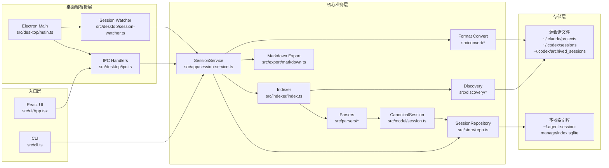

最近这段时间，我在本地同时用 **Claude Code** 和 **Codex** 做开发的频率越来越高。

工具一多，一个很烦的问题就开始反复出现：**session 太难找了**。

有些对话在 Claude 里，有些在 Codex 里；有些项目我开了很多个 worktree；有时候我只记得一句提问、一个报错，或者记得那次对话大概发生在哪个分支上，但就是想不起来它到底在哪个 session 里。

还有一个更现实的问题：两个工具也不是总能顺手可用。

有时候 Claude 这边刚好不方便用，有时候 Codex 状态不对；还有些时候，Claude 这轮表现不太符合我预期，我会很自然地想：**这段上下文能不能直接切到 Codex 继续？** 反过来也一样。

但实际操作往往很别扭。你要先把旧对话翻出来，再复制上下文，再尝试在另一边接上。如果之前那个 session 本身就已经埋在一堆历史记录里，光是“找到它”这一步，就足够把思路打断。

所以我做了这个项目：**Agent Session Manage**。

项目地址：<https://github.com/evilstar9527/agent-session-manage>

它不是一个新的 agent，也不是一个新的聊天工具。更准确地说，它是一个本地的会话管理器：把 Claude Code 和 Codex 的历史会话统一索引起来，让我可以更快地搜索、查看、恢复、导出，并且在需要的时候，尽量平滑地把对话切换到另一个工具里继续。

## 我想做的，其实不是“另一个聊天应用”

这个项目一开始的定位就很明确：**我不想重新发明 Claude Code 或 Codex，我只是想把它们已经产生出来的 session 管理得更顺手一点。**

所以它解决的问题也非常具体：

- 历史 session 不好找
- 想恢复旧对话时路径不顺手
- 想在 Claude 和 Codex 之间切换时很麻烦
- 想把有价值的对话沉淀下来时，没有一个舒服的出口

这也决定了它的设计方向：它不接管原始数据，不改变原有 CLI 的工作方式，而是站在旁边，做一层 **索引、检索和操作层**。

如果只用一句话概括，我会这样描述它：

> 它是一个以本地 Claude Code / Codex 会话文件为输入、以统一会话模型为中间层、以 SQLite 为索引层、同时提供 CLI 和桌面 UI 的本地会话管理器。

这里面最重要的是三件事：

1. **真实数据源仍然是本地会话文件**
2. **不同来源要先归一成统一模型**
3. **SQLite 只是索引层，不是 source of truth**

我很喜欢这种结构，因为它很克制。

- Claude 的会话还是 Claude 的会话
- Codex 的会话还是 Codex 的会话
- 这个工具只是让它们更容易被找到和继续使用

哪怕有一天本地索引库删了，重新扫描也就回来了。

## 这套架构大概长什么样

先看一张总图：



如果用更直白的话来说，它的工作方式其实很简单：

```text
先找到本地会话文件
  -> 解析成统一格式
    -> 写进本地索引库
      -> 在此基础上提供搜索、查看、恢复、导出、转换能力
```

整个项目最关键的点，不是 Electron，也不是 SQLite，而是中间那层统一模型。因为只有先把不同来源的 session 整理成同一类对象，后面的搜索、导出、恢复、切换这些功能，才值得做，也才不会越写越乱。

## 为什么我坚持先做“统一模型”

如果没有这层抽象，事情会很快变得很糟。

你很快就会遇到这种问题：

- 搜索 Claude 和搜索 Codex 的逻辑不一样
- 导出 Claude 和导出 Codex 的逻辑不一样
- 恢复命令生成也不一样
- 转换逻辑会散在一堆条件分支里

所以我一开始就把核心抽象放在 `src/model/session.ts` 的 `CanonicalSession` 上。

它的含义并不复杂：

> 不管输入来自 Claude 还是 Codex，最后都尽量整理成同一类会话对象。

这个对象里最重要的信息包括：

- session 基本信息
- project path
- git branch
- title / summary
- messages
- tool calls
- metadata

一旦这层统一了，很多能力都会顺着长出来：

- 搜索
- 查看详情
- pin / archive
- resume-command
- export markdown
- Claude / Codex 间转换

它们不需要为每个来源单独再做一遍。

## 会话是怎么被发现、解析和导入的

这部分主要分三步：**发现文件、解析格式、写入索引**。

### 第一步：发现文件

`src/discovery/claude.ts` 会去递归找 Claude 的 `.jsonl`，`src/discovery/codex.ts` 会扫描 Codex 的 `rollout-*.jsonl`。

这里我没有做什么“万能规则引擎”，而是明确针对两种来源分别适配。

我现在越来越喜欢这种写法：**知道格式不一样，就老老实实分别处理。**

这通常比“看起来很优雅但到处例外”的抽象更稳。

### 第二步：解析格式

`src/parsers/claude.ts` 和 `src/parsers/codex.ts` 会把原始 JSONL 整理成统一模型。

它们做的不是简单地把 JSON 读出来，而是做一层有目的的提炼，比如：

- 抽出用户和助手消息
- 整理 tool call / tool result
- 推断标题
- 记录 project path、branch、source session id
- 留一些 metadata

这里有一个现实我很早就接受了：

> 这种转换不可能 100% 无损。

所以这个项目的目标从来不是“完整重建另一个工具的所有内部运行状态”，而是做**实用型归一化**。

也就是说，它优先服务的是这些场景：

- 我想找回旧对话
- 我想搜里面提到过什么
- 我想恢复上下文继续工作
- 我想把它导出来，或者迁到另一个工具里继续

而不是去做一个协议层面的完美镜像。

### 第三步：写入索引

扫描导入流程在 `src/indexer/index.ts`，真正的落库存取在 `src/store/repo.ts`。

这里我比较满意的一个点是：**它不是每次都傻傻地全量重建。**

repo 层会保存文件指纹，比如：

- size
- mtime
- quickHash

如果文件没变，就直接跳过，不重复解析。

这个优化听起来不大，但对本地工具很重要。因为 session 一旦真的积累起来，数量会涨得很快。如果每次都全量扫一遍，体验很快就会变差。

## 为什么我把业务逻辑集中在 SessionService

这个项目里我比较刻意的一件事，是把业务能力尽量都收敛到 `src/app/session-service.ts`。

它统一暴露了这些接口：

- `scan()`
- `list()`
- `search()`
- `get()`
- `pin()`
- `archive()`
- `delete()`
- `exportMarkdown()`
- `convert()`
- `getResumeCommand()`
- `launchResume()`

这样做最大的好处就是：**CLI 和桌面端都可以变得很薄。**

`src/cli.ts` 只需要负责参数解析、调用 service、打印结果。桌面端的 `src/desktop/ipc.ts` 也只是把前端操作映射到 service 上。

这对我来说很重要，因为 UI 通常是变化最快的部分，但 discovery、parser、store、service 这些底层能力往往更稳定。只要边界划清楚，后面加功能时就不会到处互相牵扯。

## 桌面端为什么还要做 watcher

如果只有 CLI，心智其实很简单：想刷新就手动 `scan`，想找东西就用命令查。

但桌面端不一样。桌面端一旦存在，用户就会自然期待：**它应该自己知道数据变了。**

所以我做了 `src/desktop/session-watcher.ts`，去监听：

- Claude projects 目录
- Codex sessions 目录
- Codex archived_sessions 目录

文件变化后，它不会立刻全量扫描，而是做一个小防抖，再通知窗口刷新列表。

这个功能很朴素，但体验差别非常大。没有它的时候，桌面应用更像一个“偶尔手动刷新的浏览器”；有了它以后，它才更像一个真正的本地工作台。

## 对我来说，最有价值的不是搜索，而是“可以继续用”

我后来越来越觉得，这个项目最值钱的地方，并不是“我终于能搜到某个 session 了”，而是搜到之后，**我真的可以继续拿它工作**。

### 1. 可以直接恢复原生会话

`SessionService.getResumeCommand()` 会根据来源生成原生命令：

- Claude 走 `claude --resume`
- Codex 走 `codex resume`

而且桌面端还能直接帮我在终端里打开它。

这件事的关键不在命令本身，而在于它让“找回旧对话”和“继续工作”真正连起来了。

### 2. 可以导出成 Markdown

很多 agent 对话并不只是一次性的。我经常会碰到一些值得留存的内容：

- 某次排障过程
- 某次重构思路
- 某段工具调用和输出
- 某轮讨论过的取舍

当它能导出成 Markdown，它就更像一份资料，而不是一段只能被埋在工具目录里的聊天历史。

### 3. 可以在 Claude 和 Codex 之间切换

这其实最接近我做这个项目的初始动机。

我并不是想做一个“理论上完美兼容”的格式转换器，我真正想要的是：

> 当我对 Claude 当前这轮表现不满意，或者 Claude 这边暂时不好用时，我能不能尽量少折腾地把上下文迁到 Codex 去继续？

反过来也一样。

所以 conversion 的目标从来不是无损复刻，而是**尽可能保住上下文的实用价值**。只要它能让我少做一次上下文重建，少打断一次工作流，这个能力就已经很有意义了。

## 这套架构为什么我觉得是对的

如果回头看，这个项目能站住，核心原因其实就一句话：

> 我没有把它当成“另一个聊天应用”，而是把它当成“已有会话的管理层”。

这个定位影响了几乎所有设计决策。

它不接管原始数据，不试图取代 Claude Code 或 Codex，也不追求协议层面的完美洁癖。它优先解决的是工作流问题：

- 能不能找到 session
- 能不能快速恢复
- 能不能把上下文切到另一边继续
- 能不能把历史沉淀下来

我觉得这才是它真正应该服务的场景。

## 当然，它现在也还不完美

至少在我自己看来，还有几件事是后面会继续做的：

- 搜索还能更强，比如更好的全文索引和过滤组合
- 前端现在还能继续拆，尤其是 session 详情和筛选部分
- 转换能力永远有边界，这件事只能尽量做好，不能假装它是完全无损的

但这些都不影响它现在已经解决了我最在意的那部分问题：**把那些原本很容易沉下去的 session，重新变成可以找、可以看、可以接着用的东西。**

## 总结

我做 `Agent Session Manage` 的原因其实不复杂：

- session 越来越多，越来越难找
- 我经常在 Claude Code 和 Codex 之间切换
- 有时候其中一边不能用
- 有时候只是单纯想把一段上下文换到另一边继续
- 我也希望把这些历史对话变成可以搜索、恢复、导出、沉淀的东西

所以最后做出来的，不是一个新的 agent，而是一个本地会话管理器。

如果再用一句话来概括它，我现在更愿意写成这样：

> 这不是一个“重新发明 agent”的项目，而是一个把 Claude Code 和 Codex 的历史会话重新组织起来，让它们更容易被找到、更容易被继续使用的工具。

对我来说，这种工具真正重要的地方，不是技术栈本身，而是它能不能减少上下文切换的摩擦，能不能把那些本来很容易沉下去的 session，重新变成可以用起来的工作资产。