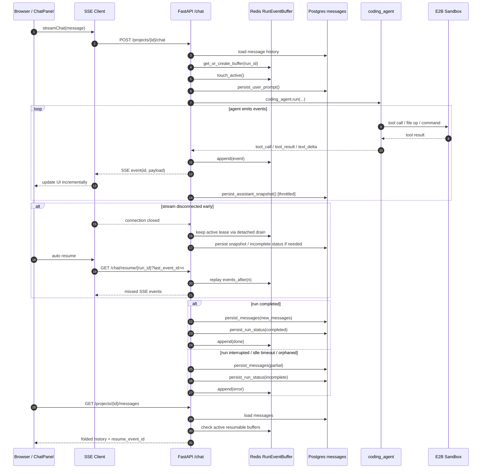
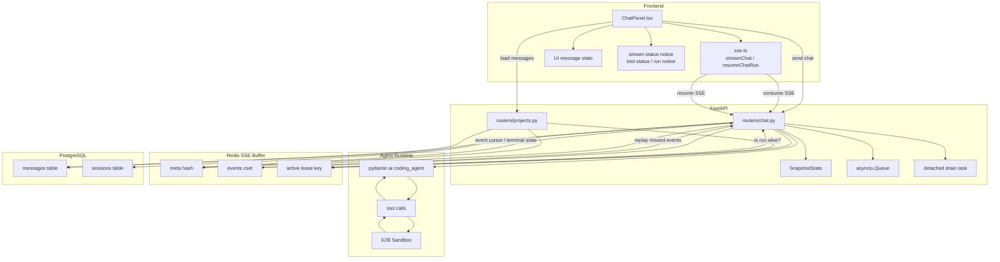
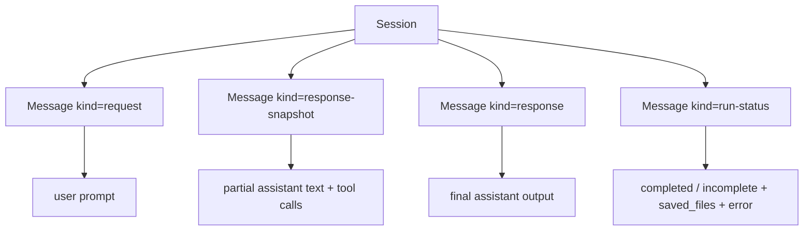

# 当前聊天 SSE 流式传输与持久化存储架构

本文描述 `tipsy-studio` 目前聊天流式传输、断线恢复、运行状态持久化、历史消息落库的真实实现。内容以当前代码为准，不是假设中的目标态。

先给出结论：

- 实时流不是 WebSocket，而是 `POST /chat` + `GET /chat/resume/{run_id}` 两段式 SSE
- 可恢复能力不是单纯依赖数据库，而是依赖 Redis 中的 `RunEventBuffer`
- 最终可长期保存的聊天历史仍然在 PostgreSQL `messages` 表
- 流式中的“中间态”分成两层：
  - Redis 中的事件缓冲，用于秒级断线恢复
  - 数据库中的 `response-snapshot` / `run-status`，用于页面刷新、重新进入项目后恢复上下文
- 当前已经从“进程内内存 buffer”迁到“Redis-backed buffer + 活跃租约”
- 当前 idle timeout 是“无有效输出超时”，不是总运行时长超时

---

## 1. 涉及模块

核心文件：

- `apps/api/routers/chat.py`
  - `/projects/{project_id}/chat`
  - `/projects/{project_id}/chat/resume/{chat_run_id}`
  - 流式事件桥接、快照持久化、run 状态持久化
- `apps/api/services/sse_buffer.py`
  - Redis-backed `RunEventBuffer`
  - 事件追加、事件回放、活跃租约、孤儿 run 终结
- `apps/api/routers/projects.py`
  - `/projects/{project_id}/messages`
  - 历史消息折叠
  - resumable run 暴露逻辑
- `apps/web/lib/sse.ts`
  - 浏览器侧 SSE 消费、自动重连、resume
- `apps/web/components/ide/ChatPanel.tsx`
  - UI 状态展示、断线恢复提示、运行中工具状态展示
- `apps/api/models.py`
  - `Message`
  - `Session`

存储与基础设施：

- PostgreSQL：长期消息历史、快照、run-status
- Redis：短期可恢复事件流、run 活跃租约
- E2B Sandbox：工具执行与工作区修改

---

## 2. 总体结构图

```mermaid
flowchart LR
    U[User / Browser]
    FE[Web IDE<br/>ChatPanel]
    SSE[Browser SSE Client<br/>streamChat / resumeChatRun]

    API[FastAPI<br/>chat.py]
    AGENT[coding_agent.run]
    SB[E2B Sandbox]

    R[(Redis<br/>RunEventBuffer + active lease)]
    DB[(PostgreSQL<br/>messages / sessions)]

    U --> FE
    FE --> SSE

    SSE -->|POST /chat| API
    SSE -->|GET /chat/resume/{run_id}| API
    FE -->|GET /messages| API

    API -->|load history| DB
    API -->|persist prompt / snapshot / final messages / run-status| DB
    API -->|append / replay / tail SSE events| R
    API --> AGENT
    AGENT -->|tool calls| SB
    SB -->|tool results| AGENT

    AGENT -->|text_delta / tool_call / tool_result| API
    API -->|SSE push| SSE
    R -->|missed events replay| API
    DB -->|folded history| API
    API --> FE
```

这个图里最关键的分层是：

- Redis 负责“短时连续性”
- PostgreSQL 负责“长期记忆”

两者不是替代关系，而是分工关系。

---

## 3. 端到端时序图



---

## 4. 两层存储模型

### 4.1 Redis 层：短期可恢复流

`apps/api/services/sse_buffer.py` 里的每个 run 会生成三类 key：

- `chat:run:{run_id}:meta`
- `chat:run:{run_id}:events`
- `chat:run:{run_id}:active`

其中：

- `meta`
  - `created_at_ms`
  - `last_event_id`
  - `last_event_time_ms`
  - `terminal`
  - `project_id`
- `events`
  - ZSET，score 使用 `event_id`
  - member 是 JSON，包含 `event_id / timestamp_ms / payload`
- `active`
  - 带 TTL 的活跃租约
  - 用来判断 run 是否仍由某个存活的后端执行流维护

职责：

- 给浏览器断线恢复提供事件重放
- 在主连接断开后，支持 detached drain 持续把事件写入 Redis
- 区分“非终态但仍活着的 run”与“孤儿 run”

### 4.2 PostgreSQL 层：长期历史

长期消息历史全部在 `messages` 表，核心 `kind` 包括：

- `request`
  - 用户 prompt
- `response`
  - 最终 assistant 输出
- `response-snapshot`
  - 流式中间快照
- `run-status`
  - `completed` / `incomplete`

职责：

- 页面刷新后仍能看见之前消息
- 重新进入项目页后能看到上一次未完成 run 的上下文
- 为后续历史回放和模型续写提供可序列化 `message_history`

### 4.3 为什么要双层

如果只有数据库：

- 每个 token / tool event 都落库太重
- resume 粒度太粗
- 前端恢复会慢

如果只有 Redis：

- 页面刷新后历史会丢
- TTL 到期后就没有长期记忆
- 无法作为后续 Agent 的稳定 `message_history`

所以当前设计不是二选一，而是：

- Redis 处理短期、高频、细粒度事件
- DB 处理稳定、长期、语义化消息

---

## 5. 后端流式主链路

### 5.1 `/chat` 的主路径

入口是 `apps/api/routers/chat.py` 的 `agent_chat()`。

主流程：

1. 生成新的 `chat_run_id`
2. 解析模型选择
3. 查找当前项目活跃 `Session`
4. 创建或获取 `RunEventBuffer`
5. `touch_active()` 建立 run 活跃租约
6. 加载并修复历史消息
7. 持久化用户 prompt
8. 调用 `coding_agent.run(...)`
9. 通过队列桥接 pydantic-ai 事件到 SSE payload
10. 一边往 Redis 追加事件，一边向前端发送 SSE
11. 节流持久化 `response-snapshot`
12. 完成后持久化最终消息与 `run-status`

### 5.2 事件映射

后端暴露给前端的 UI 事件类型目前包括：

- `text_delta`
- `tool_call`
- `tool_result`
- `status`
- `ping`
- `done`
- `error`

来源关系：

- pydantic-ai 文本事件 -> `text_delta`
- pydantic-ai 工具调用事件 -> `tool_call`
- pydantic-ai 工具返回事件 -> `tool_result`
- 长工具空档期间的保活进度 -> `status`
- SSE keepalive -> `ping`
- 正常结束 -> `done`
- 异常结束 / idle timeout / orphaned -> `error`

### 5.3 运行中快照

`SnapshotState` 维护这些字段：

- `text`
- `tool_calls`
- `message_id`
- `dirty`
- `last_flushed_at`
- `last_event_id`

它的作用是：

- 不等 run 完成，就把当前 assistant 已生成内容以 `response-snapshot` 形式写库
- 这样即使浏览器刷新、页面退出、连接重建，用户也能看见已经产生的部分输出

---

## 6. 断线恢复架构

### 6.1 主连接断开后的两条路径

主 SSE 连接断开后，系统会区分两种情况：

1. 后端进程还活着，agent 还在跑
2. 后端进程已死，run 成为孤儿

### 6.2 detached drain

如果是情况 1：

- `stream_with_agent_run()` 的 `finally` 会启动 detached drain
- detached drain 继续消费 agent queue
- 新事件仍然写入 Redis buffer
- 同时持续 `touch_active()`

这样前端重新发起 `/chat/resume/{run_id}` 时，可以从 Redis 接上。

### 6.3 orphaned run 检测

如果是情况 2：

- Redis 里可能还留着非终态事件
- 但 `chat:run:{run_id}:active` 租约已经消失

当前策略：

- `resume_chat_stream()` 在恢复前先检查 run 是否失活
- 若失活且非终态，则调用 `mark_orphaned()`
- 这会补一条终态 `error` 事件
- 之后前端不会无限 spinner，而是看到明确终止

### 6.4 可恢复 run 暴露条件

`/projects/{project_id}/messages` 不再只看 “buffer 存在且非终态”，而是同时要求：

- buffer 存在
- `not buf.is_terminal`
- run 的 `active` 租约仍然存在
- `project_id` 匹配

这就是为什么现在页面不会再把孤儿 run 误认为“仍可恢复”。

---

## 7. idle timeout 与进度事件

### 7.1 当前超时语义

当前不是“整个 run 最长只能跑 N 秒”，而是：

- 如果超过 `chat_agent_idle_timeout_seconds`
- 且这段时间内没有新的有效输出
- 则判定 run stalled

默认配置：

- `chat_agent_idle_timeout_seconds = 180`
- `chat_agent_progress_interval_seconds = 15`

### 7.2 什么算有效输出

有效输出包括：

- `text_delta`
- `tool_call`
- `tool_result`
- 终态事件

不算有效输出：

- `ping`

### 7.3 为什么新增 `status`

用户真正抱怨的问题不是“run 太久”，而是：

- 工具执行很久
- 前端什么都不显示
- 看起来像卡死

因此当前实现加了周期性 `status`：

- 如果 run 正在进行，但一段时间内没有新文本/工具结果
- 后端会发一条 `status=working`
- 前端把它显示成 “Still working...”

这解决的是“可见性问题”，不是单纯延长超时。

---

## 8. 详细组件图



---

## 9. Redis 数据结构图

```mermaid
flowchart LR
    RUN[run_id]

    RUN --> MK[chat:run:{run_id}:meta]
    RUN --> EK[chat:run:{run_id}:events]
    RUN --> AK[chat:run:{run_id}:active]

    MK --> M1[created_at_ms]
    MK --> M2[last_event_id]
    MK --> M3[last_event_time_ms]
    MK --> M4[terminal]
    MK --> M5[project_id]

    EK --> E1[event_id=1 -> payload json]
    EK --> E2[event_id=2 -> payload json]
    EK --> E3[event_id=n -> payload json]

    AK --> A1[TTL-based lease]
```

---

## 10. 数据库消息模型图



---

## 11. 页面重新进入为什么还能看到一部分 agent 消息

这是两层机制叠加的结果：

### 11.1 短时间内

如果 run 还没结束，且 Redis buffer 还在：

- 前端通过 `resume_event_id` 发 `resume`
- Redis 回放缺失事件

### 11.2 长一点的时间尺度

即使页面彻底退出再进来：

- `/messages` 会返回数据库里已保存的 `response-snapshot`
- 所以用户仍能看到 agent 之前已经输出过的一部分内容

这也是为什么当前实现里 `response-snapshot` 很重要：

- 没有它，页面退出再回来就只能看见最终 response 或空白
- 有了它，run 中途退出后仍可恢复“看到过的内容”

---

## 12. 当前设计的关键取舍

### 12.1 为什么 Redis 不直接替代 DB

因为 Redis 解决的是“传输连续性”，不是“产品记忆”。

### 12.2 为什么要有 active lease

因为只看 “events 还在、terminal=false” 不够：

- 进程热重载
- 容器异常退出
- worker 重启

都会留下“非终态但没人维护”的假活 run。

### 12.3 为什么 snapshot 不按每个 token 落库

因为太重。

当前做法是：

- Redis 保存细粒度事件
- DB 节流写 snapshot

这是成本和恢复体验之间的折中。

### 12.4 为什么 `wait_for_new()` 还在轮询 Redis

当前是工程上更稳妥的版本：

- 不依赖 Redis Pub/Sub 或 keyspace notifications
- 本地、docker、测试环境都一致

代价是：

- 多 resume 客户端时会产生额外 Redis 读压力

这已经在代码里用注释明确标出来，后续若 resume 并发显著上升，应升级为主动通知模式。

---

## 13. 当前已知限制

### 13.1 `wait_for_new()` 仍是轮询

- 当前是 `0.2s` 轮询一次 meta
- 高并发 resume 下会有 Redis 压力

### 13.2 Redis buffer 仍有 TTL / max_events 窗口限制

- 它不是永久历史
- 只保证短期断线恢复

### 13.3 snapshot 不是精确逐事件镜像

- 它是节流刷盘的语义快照
- UI 重新进入后看到的是最近一次刷盘状态
- 不是 Redis 事件流的 1:1 全量复刻

---

## 14. 后续演进方向

优先级从高到低：

1. `wait_for_new()` 从轮询升级为 Redis Pub/Sub 或通知驱动
2. 给 Redis append 引入 Lua / 单事务脚本，进一步强化多写者安全性
3. 为 snapshot 增加更明确的 flush 策略指标与观测
4. 把 resume 相关指标纳入 observability
   - resume 成功率
   - orphaned run 数量
   - detached drain 持续时长
   - idle timeout 次数

---

## 15. 一句话总结

当前聊天 SSE 架构的本质是：

- 用 Redis 保证“流不中断”
- 用 PostgreSQL 保证“历史不丢失”
- 用 active lease 区分“还活着的 run”和“已经死掉的 run”
- 用 snapshot + run-status 让用户在刷新、重进、断网重连后仍然看得见、接得上、知道发生了什么
