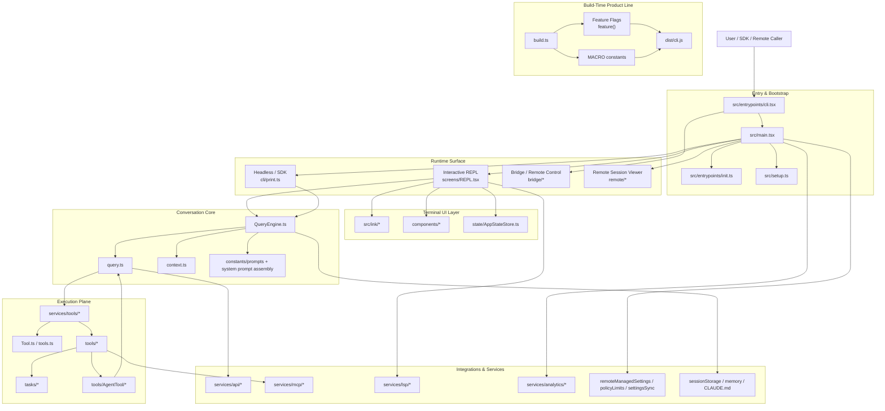

基于 `@anthropic-ai/claude-code` v2.1.88 还原源码梳理。

## 1. 架构结论

Claude Code 不是一个“简单 CLI”，而是一个**单进程宿主（host）+ 会话引擎（conversation engine）+ 工具平台（tool platform）+ 多代理任务系统（multi-agent task runtime）**的 TypeScript/Bun 单体应用。

它的核心特征有 4 个：

1. **单进程多入口**
   `src/entrypoints/cli.tsx` 先做轻量分流，按命令进入普通 REPL、headless print/SDK、bridge、daemon、remote control 等不同运行形态。
2. **统一会话内核**
   无论是交互式 REPL 还是非交互 SDK，核心都汇聚到 `QueryEngine` / `query()` 这条消息循环。
3. **工具优先的 Agent 运行时**
   模型只负责生成消息和 tool_use，真正执行文件、shell、MCP、子代理、远端任务的是本地工具与任务系统。
4. **产品线式编译**
   `build.ts` 用 Bun 的 `feature()` 做编译期开关，很多内部能力通过 dead code elimination 被裁掉，因此“Claude Code 架构”本质上是一个**可裁剪产品线架构**。

## 2. 整体架构图



### 纯文本分层图

```text
Shell / SDK / Remote caller
  -> entrypoints/cli.tsx
    -> main.tsx
      -> init.ts + setup.ts
        -> REPL (interactive) / print.ts (headless) / bridge / remote
          -> QueryEngine + query loop
            -> Claude API stream
            -> Tool orchestration
              -> local tools
              -> MCP tools/resources
              -> shell/file tools
              -> AgentTool / subagent
              -> remote/background tasks
            -> session persistence / telemetry / memory / policy
```

## 3. 源码分层

按目录统计，源码最重的部分不是“入口”而是“能力面”：

| 目录 | 文件数（近似） | 含义 |
|---|---:|---|
| `utils` | 567 | 共用基础设施、状态操作、IO、git、session、权限、模型工具 |
| `components` | 390 | 终端 UI 组件 |
| `commands` | 209 | slash command / 子命令体系 |
| `tools` | 190 | 供模型调用的工具实现 |
| `services` | 133 | API、MCP、LSP、analytics、compact、memory 等服务 |
| `hooks` | 104 | 交互与生命周期 hook |
| `ink` | 98 | 自研终端渲染层 |

这说明它本质上是一个**宿主型应用**：入口薄，运行时能力厚。

## 4. 启动架构

### 4.1 第一层入口：`src/entrypoints/cli.tsx`

这一层的职责是：

- 提供超轻量 fast path，例如 `--version`
- 在真正加载大模块前分流特殊模式
- 通过动态 import 避免不必要的模块求值

可理解为一个 **boot dispatcher**。

### 4.2 第二层入口：`src/main.tsx`

这一层是真正的主控器，职责非常重：

- 初始化 warning handler、信号处理
- 处理深链路、direct connect、ssh、assistant、bridge 等特殊入口
- 用 Commander 建立完整 CLI 语义
- 在 `preAction` 中统一调用 `init()`
- 将运行模式导向 REPL、print、bridge、remote 等不同表面

因此 `main.tsx` 是**运行时编排器**，不是单纯参数解析器。

### 4.3 初始化：`src/entrypoints/init.ts`

`init()` 负责做“可信但尽量轻”的全局初始化：

- 启用配置系统
- 应用安全环境变量
- 配置 mTLS / proxy / preconnect
- 初始化 telemetry、remote managed settings、policy limits
- 注册清理逻辑

这层的设计目标很明确：**把重初始化尽量摊薄到异步和缓存里，但又保证最关键的运行前提先就绪**。

### 4.4 会话级准备：`src/setup.ts`

`setup()` 偏向“当前会话环境落地”，包括：

- cwd 与项目根建立
- hook snapshot 与 file watcher 初始化
- worktree / tmux 建立
- session memory、release notes、terminal backup 恢复

所以：

- `init.ts` 更像**进程级初始化**
- `setup.ts` 更像**会话级初始化**

## 5. 交互表面架构

Claude Code 有多个运行表面，但复用同一套内核。

### 5.1 交互式模式

主链路：

`main.tsx -> createRoot() -> replLauncher.tsx -> components/App -> screens/REPL.tsx`

其中：

- `src/ink.ts` 与 `src/ink/root.ts` 提供自研终端 React 渲染根
- `src/screens/REPL.tsx` 是主交互容器
- `src/state/AppStateStore.ts` 管理 UI、MCP、任务、bridge、remote viewer 等状态

这套设计说明 Claude Code 不是“命令执行器包一层 UI”，而是**先有终端应用框架，再承载 Agent**。

### 5.2 Headless / SDK 模式

主链路：

`main.tsx -> cli/print.ts -> QueryEngine.ask()`

这一层负责：

- 结构化输入输出
- stream-json / text / json 输出协议
- SDK control 消息
- 权限请求桥接
- headless 的会话恢复与插件/MCP 装配

因此 print 模式本质上是**无 UI 的协议适配层**。

### 5.3 Bridge / Remote / Viewer

- `bridge/*`：本机作为远端可控执行环境
- `remote/*`：连接远端 session，接收 SDK 消息和权限请求
- `server/*`：direct connect / session creation 一类能力

这是 Claude Code 向“本地 CLI”之外扩展的关键：它开始具备**双向远程会话宿主**能力。

## 6. 会话内核：`QueryEngine` + `query()`

这是整个系统最核心的层。

### 6.1 `QueryEngine.ts`

`QueryEngine` 持有一段会话生命周期内的核心状态：

- `mutableMessages`
- `readFileState`
- permission denials
- usage 累计
- abort controller
- discovered skills / memory path 等 turn/session 级上下文

它的角色是**面向会话的外观层（session facade）**。

### 6.2 `query.ts`

`query()` 才是真正的 turn loop：

- 拼接系统提示与上下文
- 处理 message normalization
- 发起 Claude API 请求
- 处理 streaming 消息
- 提取 `tool_use`
- 执行工具
- 将 `tool_result` 回注消息流
- 继续下一轮直到终止

它的角色是**面向单次 agentic turn 的状态机**。

### 6.3 共享内核的意义

REPL 和 print/SDK 都复用这套内核，意味着架构上做了明确分离：

- 上层负责“人机交互/协议”
- 下层负责“消息循环/工具回路”

这是本项目最正确的一刀。

## 7. 单轮执行时序图

```mermaid
sequenceDiagram
    participant User as User / SDK
    participant Surface as REPL or print.ts
    participant Engine as QueryEngine
    participant Loop as query()
    participant API as services/api/claude.ts
    participant Tools as services/tools/*
    participant Impl as tools/* / MCP / tasks

    User->>Surface: prompt / input event
    Surface->>Engine: submitMessage() / ask()
    Engine->>Engine: processUserInput()
    Engine->>Loop: query(params)
    Loop->>API: stream message request
    API-->>Loop: assistant deltas / tool_use
    Loop->>Tools: runTools() / StreamingToolExecutor
    Tools->>Impl: execute tool
    Impl-->>Tools: tool_result / progress
    Tools-->>Loop: Message updates + new context
    Loop->>API: next round with tool_result
    API-->>Loop: final assistant message
    Loop-->>Engine: messages + usage + terminal result
    Engine-->>Surface: SDKMessage / UI state updates
```

## 8. 工具平台架构

### 8.1 元模型：`src/Tool.ts`

这里定义了工具系统的核心抽象：

- tool schema
- permission context
- tool use context
- progress / UI 回调
- app state 访问

`ToolUseContext` 很关键，它不是简单参数包，而是**运行时能力注入容器**。

### 8.2 工具注册：`src/tools.ts`

`tools.ts` 负责：

- 聚合所有内建工具
- 按 feature flag / env / policy 暴露工具
- 根据运行环境裁剪工具集

因此工具系统不是“扫描目录自动发现”，而是**显式装配、可裁剪、可做 prompt cache 稳定控制的工具池**。

### 8.3 工具调度：`services/tools/*`

关键模块：

- `toolOrchestration.ts`：按并发安全性分批执行
- `StreamingToolExecutor.ts`：边流式产生 tool_use 边执行，并维护有序产出
- `toolExecution.ts`：单个工具执行

这里的设计很成熟：

- 只读 / 并发安全工具可并行
- 有副作用工具串行
- 即使并行执行，也保证结果按原始 tool_use 顺序回吐

这说明架构目标不是“最大吞吐”，而是**有约束的并行**。

## 9. 多代理与任务系统

这是 Claude Code 区别于普通 CLI Agent 的另一核心。

### 9.1 AgentTool

`tools/AgentTool/AgentTool.tsx` 是多代理入口，支持：

- 新子代理
- 指定 agent type
- 背景运行
- worktree 隔离
- remote 隔离
- team / teammate 模式

它既是一个工具，也是**任务系统的控制面入口**。

### 9.2 runAgent

`tools/AgentTool/runAgent.ts` 做的事情包括：

- 组装 agent 的 system prompt
- 为 agent 初始化专属 MCP server
- 克隆 / 隔离 ToolUseContext
- 调用 `query()` 运行子代理
- 记录 sidechain transcript

也就是说，子代理不是一个特别的协议对象，本质上仍然是**另一个 QueryEngine/query runtime**。

### 9.3 任务系统

`Task.ts` + `tasks/*` 定义统一任务抽象，当前主要有：

- `local_bash`
- `local_agent`
- `remote_agent`
- `in_process_teammate`
- `dream`

其中：

- `LocalAgentTask` 管后台本地 agent 的状态、输出文件、通知、前后台切换
- `RemoteAgentTask` 管远端 Claude.ai/CCR session 的轮询、恢复、归档
- `LocalShellTask` 管 Bash/PowerShell 等 shell 任务

因此任务系统的作用不是“仅做 UI 展示”，而是**把长生命周期执行单元从 Query 主循环中拆出来管理**。

## 10. MCP 架构

`services/mcp/client.ts` 是另一个核心模块。

它负责：

- 连接 MCP server（stdio / SSE / streamable HTTP / websocket）
- OAuth / auth 处理
- 拉取 tools / prompts / resources
- 将 MCP 工具转成本地可用 Tool
- 做工具结果截断、持久化、二进制落盘

`MCPConnectionManager.tsx` 则把连接管理嵌入到 UI 上下文。

所以 MCP 在 Claude Code 里不是附属插件，而是**一级能力平面**。

## 11. 状态架构

Claude Code 有两层状态：

### 11.1 进程级全局状态：`bootstrap/state.ts`

这里放的是进程级 latch 和统计：

- cwd / sessionId / model / telemetry
- prompt cache 相关 sticky flag
- invoked skills
- global counters
- session lineage

这层更像**process runtime registry**。

### 11.2 UI / 会话视图状态：`state/AppStateStore.ts`

这里放的是当前交互态：

- tasks
- mcp clients/tools/resources
- plugin state
- permission context
- 当前 viewing agent / foregrounded task
- bridge / remote viewer 状态

这层更像**presentation-oriented session state**。

## 12. 上下文与记忆架构

`context.ts` 暴露两类核心上下文：

- `getSystemContext()`：git 状态、cache breaker 等系统级上下文
- `getUserContext()`：CLAUDE.md、日期、memory 文件

这说明 Claude Code 的“记忆”首先不是向量库，而是**文件化上下文 + 会话附着上下文**：

- CLAUDE.md
- memory files
- session transcript
- task output sidechain

这和 IDE/代码代理场景非常一致，也降低了外部存储依赖。

## 13. 编译期产品线架构

`build.ts` 非常重要，因为它决定“最终产品到底长什么样”。

它通过：

- `featureFlags`
- `MACRO.*`
- Bun bundler 的 `feature()`

做编译期裁剪。

这意味着：

1. 源码里存在一套比公开 npm 包更大的能力面
2. 外部版本只是该产品线上的一个裁剪结果
3. 架构分析必须区分“源码全量能力”与“external build 默认能力”

这是理解 Claude Code 源码时最容易被忽略的一点。

## 14. 关键设计判断

### 14.1 它是单体，但不是臃肿单体

虽然文件很多，但主分层其实很清晰：

- 入口层
- 交互层
- 查询内核
- 工具执行层
- 集成服务层

这是一种**宿主型单体（host monolith）**，不是业务脚本堆积。

### 14.2 Query loop 是绝对中心

真正的中心不是 UI、不是 commands、也不是 tools，而是：

`QueryEngine -> query() -> API/tool round-trip`

其它几乎都围绕这条环工作。

### 14.3 Tool 与 Task 是两个层次

- Tool：模型可调用的能力接口
- Task：长生命周期、可恢复、可后台化的执行单元

这两层分开是对的，否则后台 agent、remote session、shell job 会把 query loop 搞得非常混乱。

### 14.4 REPL 与 SDK 共享内核是最值钱的抽象

这让 Claude Code 同时具备：

- 终端产品
- SDK 运行时
- 远端会话宿主

而不用维护三套 agent 内核。

## 15. 一句话总结

Claude Code 的源码可以概括为：

> 一个用 Bun 构建、以 `query()` 为中心、以 Tool/Task 为执行平面、以 REPL/SDK/Bridge 为多表面的可裁剪单体 Agent 运行时。

如果后续要继续拆专题，建议优先再写 4 篇：

1. `QueryEngine/query` 详细执行流
2. Tool/Task/AgentTool 三层关系
3. MCP 接入与权限/认证模型
4. REPL UI 状态机与自研 Ink 渲染层
