## 1. 先说结论

这份源码里的 `task` 不是一个单一概念，而是两个相关但不同的子系统：

- 运行时后台任务系统
  - 管理正在运行或已结束的后台 bash、agent、remote session 等
  - 核心文件：`Task.ts`、`tasks.ts`、`utils/task/framework.ts`、`AppStateStore.ts`
- TodoV2 任务清单系统
  - 管理“要做什么”的结构化任务列表
  - 核心文件：`utils/tasks.ts`、`useTasksV2.ts`、`TaskCreateTool`、`TaskUpdateTool`、`TaskListTool`

这两个系统名字都叫 task，但职责完全不同：

- 后台任务系统回答的是 “谁正在跑、输出在哪、怎么停”
- 任务清单系统回答的是 “还有哪些工作项、谁负责、依赖关系是什么”

---

## 2. 总体关系图

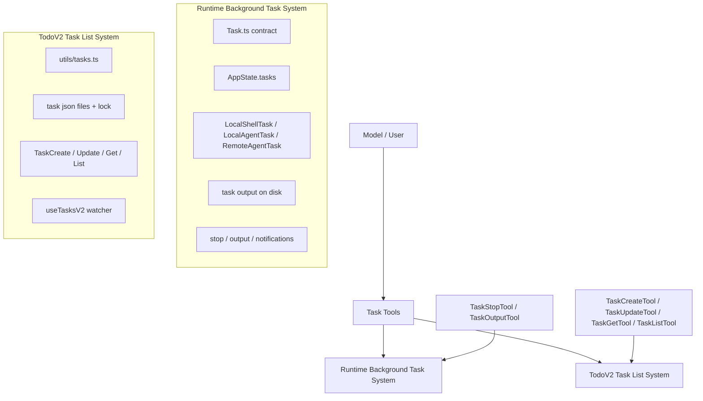

最容易误读源码的地方就在这里：`TaskStopTool` 停的是运行中的后台任务，不是 TodoV2 清单里的任务项；`TaskUpdateTool` 更新的是清单任务，不是后台进程状态。

---

## 3. 运行时后台任务系统

### 3.1 核心抽象

后台任务的统一协议在 `src/Task.ts`：

- `TaskType`
- `TaskStatus`
- `TaskStateBase`
- `Task`
- `generateTaskId()`
- `createTaskStateBase()`

它的设计很克制，`Task` 本体只保留：

- `name`
- `type`
- `kill(taskId, setAppState)`

也就是说，当前这一层不是一个完整的 OO 基类体系，而是一个最小 kill-dispatch 协议。  
任务的 spawn、progress、notification、output 逻辑，下沉到了各个具体 task 实现中。

### 3.2 运行时任务分层图

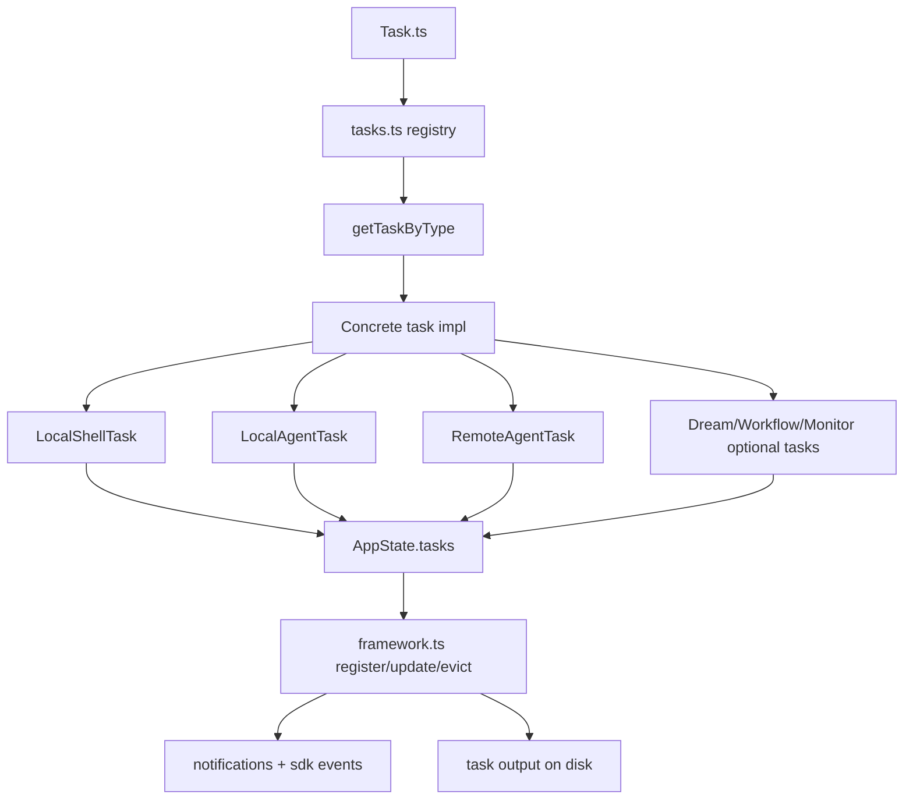

这里的关键思想是：

- task 类型是开放集合，但统一通过 registry 查找
- 公共状态收口在 `AppState.tasks`
- 公共框架只管注册、更新、驱逐、通知
- 真正的业务生命周期由具体 task 自己实现

---

## 4. AppState 为什么是任务系统的中心

后台任务统一存在 `AppState.tasks` 里，而不是每种任务自己维护一套 store。

这在 `AppStateStore.ts` 里很明显：

- `tasks: { [taskId: string]: TaskState }`
- `foregroundedTaskId`
- `viewingAgentTaskId`
- `remoteBackgroundTaskCount`

### 4.1 状态视图图

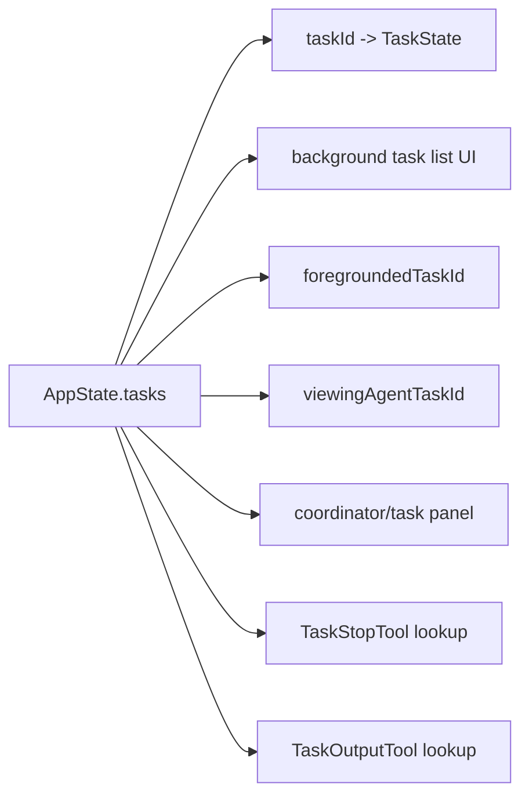

这样做有几个直接收益：

- 所有 UI 都从一个状态源读取
- `TaskStopTool` 不需要知道 task 存在哪，只查 `AppState.tasks`
- 前后台切换只需要改 task state，不需要迁移数据结构
- 不同 task type 可以复用统一生命周期字段

---

## 5. framework.ts 是运行时任务框架层

`src/utils/task/framework.ts` 是后台任务系统的核心公共层。它主要负责：

- `registerTask()`
- `updateTaskState()`
- `evictTerminalTask()`
- `generateTaskAttachments()`
- `applyTaskOffsetsAndEvictions()`
- `pollTasks()`

### 5.1 框架职责图

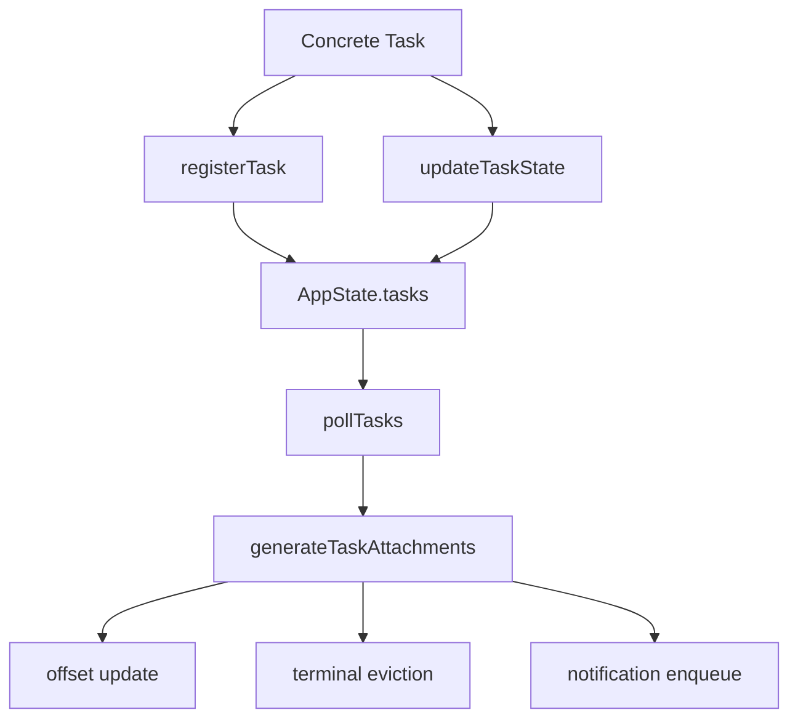

几个关键点：

- `updateTaskState()` 是统一写入口，避免各处直接改 `AppState.tasks`
- `registerTask()` 在状态登记外，还会发 `task_started` SDK 事件
- 终态任务不是立刻全删，而是受 `notified`、`retain`、`evictAfter` 约束
- `generateTaskAttachments()` 不直接负责 completed 通知，completed 通知大多由各 task 类型自己发

这说明作者有意把 framework 限制在“状态基础设施”层，而不是做成一个吞掉所有差异的超大调度器。

---

## 6. 输出系统：为什么 task output 单独做了一层

后台任务最核心的问题之一是输出管理。这里拆成了两层：

- `DiskTaskOutput`
- `TaskOutput`

### 6.1 输出架构图

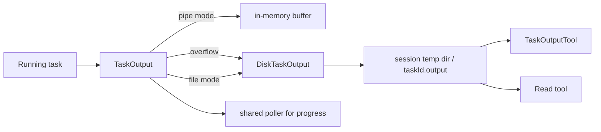

设计上有两个重点：

- 对 bash 这种文件模式，stdout/stderr 尽量绕过 JS，直接落文件
- 对 hook/pipe 模式，先缓存在内存，超阈值再 spill to disk

`diskOutput.ts` 还专门做了几件工程化处理：

- session 级输出目录隔离，避免并发 session 互相踩
- `O_NOFOLLOW` 防止符号链接攻击
- 5GB disk cap
- fire-and-forget 写操作跟踪，避免测试 teardown 时出现异步悬挂

这说明 task 输出在这里不是附属功能，而是后台任务系统的一级公民。

---

## 7. LocalShellTask：后台 bash 任务怎么实现

`LocalShellTask` 体现的是“把 shell command 变成可管理任务”。

### 7.1 生命周期图

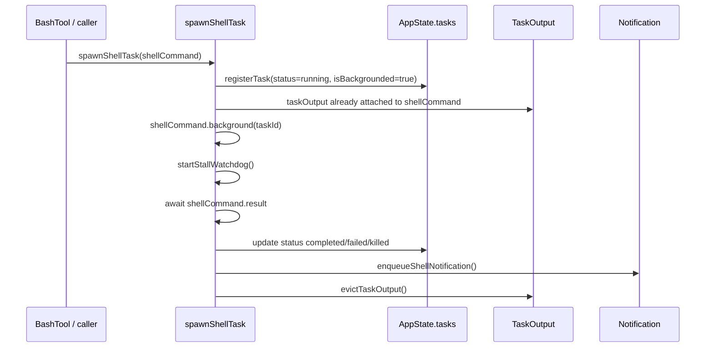

这个实现里有几个很实用的点：

- `startStallWatchdog()` 会观察输出 tail，检测像 `(y/n)` 这样的交互提示
- 前台运行过久后也可以登记成 foreground task，再 background
- shell task 结束后会统一发 task notification，而不是只改 state

这说明 shell task 在这里不是 “子进程句柄”，而是“带观察、通知、恢复语义的后台作业”。

---

## 8. LocalAgentTask：后台 agent 任务怎么实现

`LocalAgentTask` 其实比 shell task 更复杂，因为它不只是运行，还要支持：

- 进度统计
- activity 摘要
- 前后台切换
- teammate transcript 视图
- retain / evictAfter
- AbortController 父子链

### 8.1 Agent 任务结构图

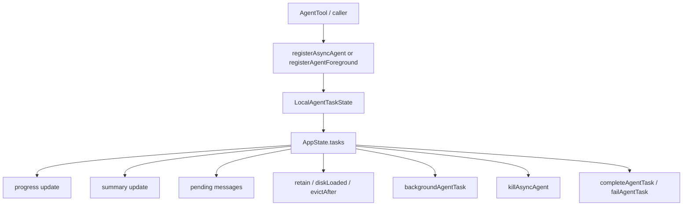

### 8.2 关键设计点

- `registerAsyncAgent()` 是一开始就后台化
- `registerAgentForeground()` 是前台执行，但保留后续 background 的可能
- `backgroundAgentTask()` 的本质是改 `isBackgrounded` 并触发等待 promise
- transcript 输出不是简单写文件，而是通过 symlink 指到 agent transcript
- progress 不是靠任务系统轮询 tool output，而是从 agent message 流里聚合出来

这是一个很重要的区别：

- shell task 的“真相”主要在进程输出
- agent task 的“真相”主要在消息流和 transcript

所以两者虽然都叫 task，但底层观测模型完全不同。

---

## 9. RemoteAgentTask：后台任务还能落到远端 session

`RemoteAgentTask` 说明这套 task 系统并不绑定本地进程。  
它把远端 session 也包装成统一 task state，纳入同一个 `AppState.tasks`。

### 9.1 远端任务图

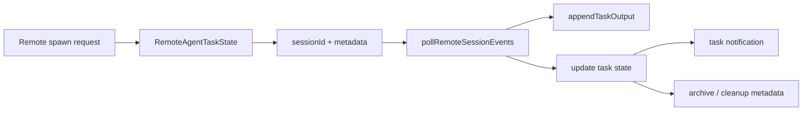

这说明 task 子系统的抽象层级是“可被统一管理的异步工作单元”，而不是“本地线程/进程”。

---

## 10. 停止与取出输出：运行时任务对模型的桥

后台任务系统主要通过两个 tool 暴露给模型：

- `TaskStopTool`
- `TaskOutputTool`

### 10.1 停止链路图

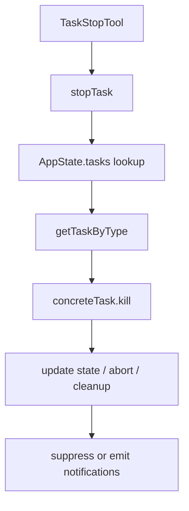

`stopTask.ts` 的设计很干净：

- 先查 task
- 验证是否 running
- 按 `task.type` 找实现
- 调 `kill()`

也就是说，停止路径是真正用到了 `Task` registry 的多态分发。

### 10.2 输出链路图

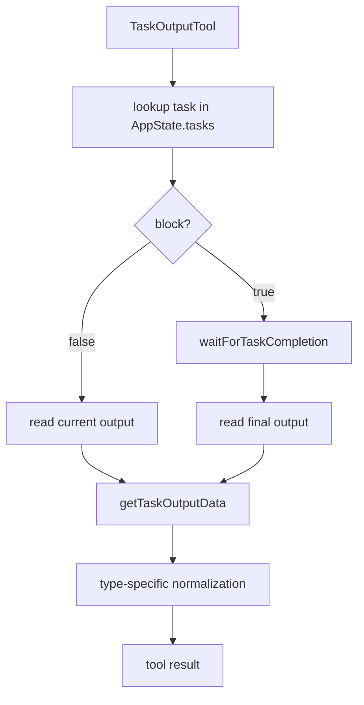

`TaskOutputTool` 的一个重要信号是：它已经被标记为 deprecated，推荐直接用 `Read` 去读 task output file。  
这说明任务系统的输出最终被收敛成“可读文件路径”这个更通用的抽象。

---

## 11. TodoV2 任务清单系统

另一套 `task` 是 `utils/tasks.ts` 驱动的结构化任务清单系统。

它不是运行时进程管理，而是轻量任务数据库，底层直接用文件系统：

- 每个 task 一个 json 文件
- 目录按 taskListId 划分
- 用高水位文件保证 ID 不回退
- 用 lockfile 避免并发写冲突

### 11.1 任务清单存储图

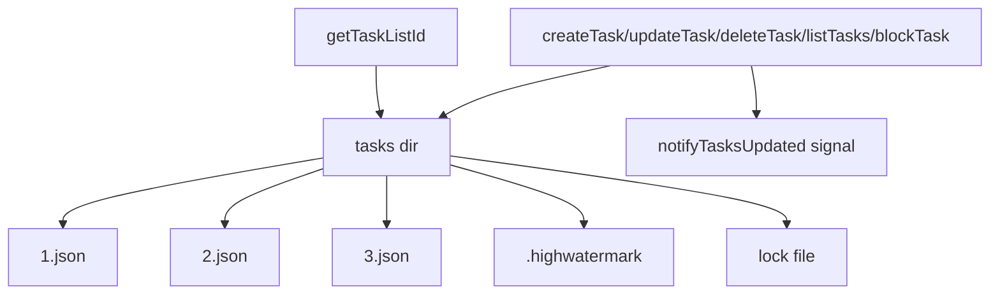

### 11.2 为什么 taskListId 设计得这么复杂

`getTaskListId()` 的优先级并不简单，因为它要让：

- 独立 session
- team lead
- in-process teammate
- tmux/iTerm teammate

都能落到同一套任务清单里，而不是各自有一份。

所以这套系统本质上是一个“共享工作分解板”。

---

## 12. TaskCreate / Update / List / Get 是清单系统的 API 层

这些工具并不操作 `AppState.tasks`，而是操作 `utils/tasks.ts` 的文件化任务清单。

### 12.1 清单工具关系图

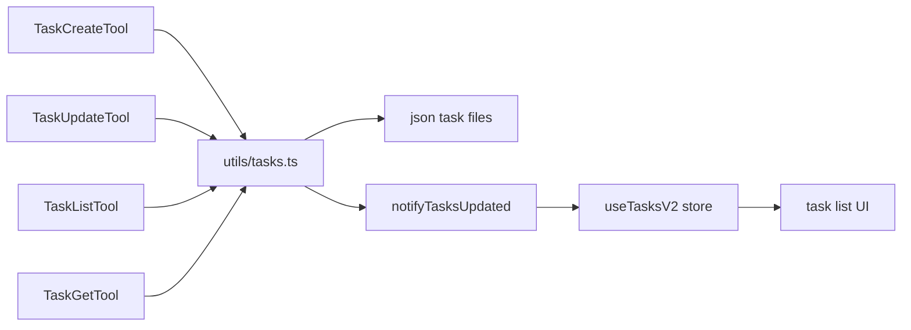

几个关键点：

- `TaskCreateTool` 创建新任务，并自动展开 task 面板
- `TaskUpdateTool` 支持状态更新、owner、metadata、依赖关系修改
- `TaskListTool` 会过滤掉内部任务，并对已完成依赖做清理展示
- `TaskGetTool` 是按 ID 读取详情

注意：这里的 status 是 `pending / in_progress / completed`，和后台任务系统的 `pending / running / completed / failed / killed` 不是一套状态机。

---

## 13. useTasksV2：清单系统的 UI 同步层

`useTasksV2.ts` 做的不是业务逻辑，而是把文件系统任务清单转成稳定的前端 store。

### 13.1 同步图

```mermaid
flowchart TD
    A[TasksV2Store] --> B[listTasks()]
    B --> C[#tasks cache]
    C --> D[useSyncExternalStore consumers]

    E[fs.watch] --> A
    F[onTasksUpdated signal] --> A
    G[fallback poll] --> A

    A --> H[hide timer]
    H --> I[all completed for 5s]
    I --> J[resetTaskList]
```

这层设计得很务实：

- 多个组件共享一个 watcher，避免 mount/unmount 抖动
- `fs.watch + signal + fallback poll` 三路兜底
- 全部完成 5 秒后自动隐藏并 reset

所以 TodoV2 清单系统不是“每次 render 去读文件”，而是一个有缓存、有 watcher、有生命周期的轻量本地数据源。

---

## 14. 两套 task 系统的关系

这两套系统不是上下级，而是并列存在、分别解决不同问题。

### 14.1 关系图

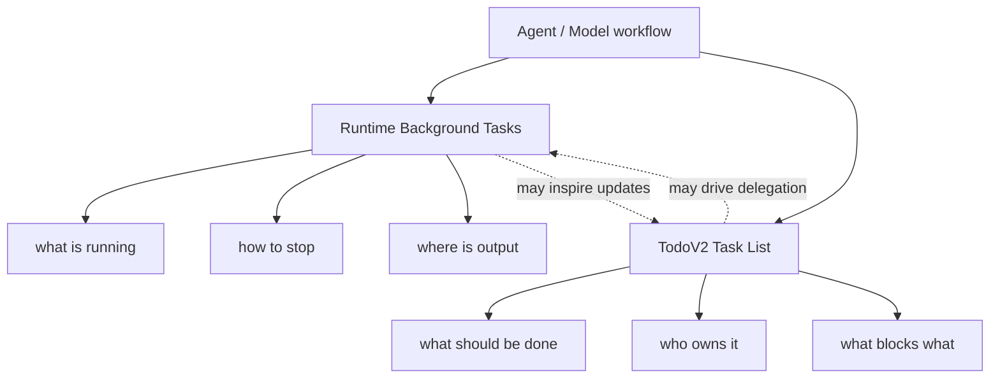

用一句话概括：

- 后台任务系统管理“执行中的异步工作”
- TodoV2 管理“结构化工作计划”

两者会互相配合，但不是同一个状态模型。

---

## 15. 设计优点与代价

### 优点

- 后台任务和任务清单职责清晰，虽然同名但边界明确
- 后台任务统一收口到 `AppState.tasks`，易于做 UI 和 tool 集成
- 输出系统独立成层，兼容本地进程、agent transcript、远端 session
- TodoV2 直接基于文件系统，简单、可共享、易恢复
- task registry 只负责最小多态分发，没有过度抽象

### 代价

- “task” 一词严重重载，初读源码很容易混淆两套系统
- 后台任务和 TodoV2 各有自己的状态机，理解成本高
- 某些行为跨文件分散，比如通知在具体 task 里，轮询在 framework 里，输出在 utils/task 里
- `TaskOutputTool` 已经开始退场，说明接口层正在演进，历史兼容负担仍在

---

## 16. 一句话总结

Claude Code 的 `task` 实现不是单一模块，而是两套系统并存：

- 一套是运行时后台任务内核，负责异步执行、停止、输出、通知
- 一套是 TodoV2 任务清单，负责工作分解、依赖、归属和 UI 展示

如果只看名字会觉得混乱，但从职责上看，这个切分其实是合理的。
