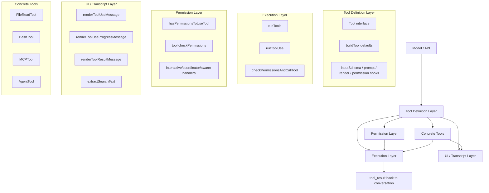
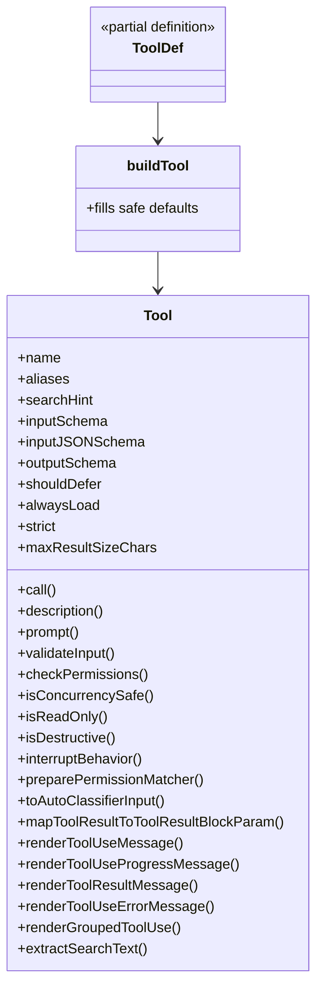
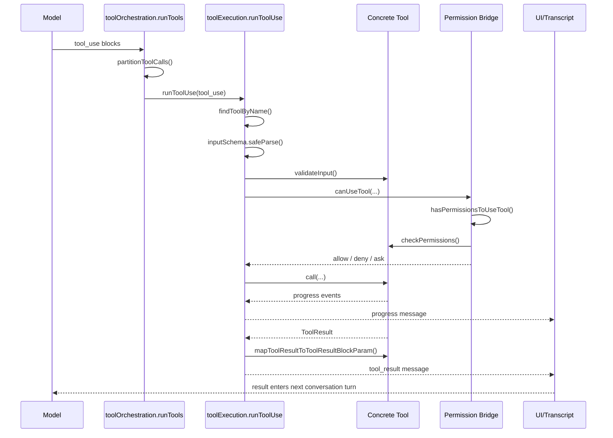
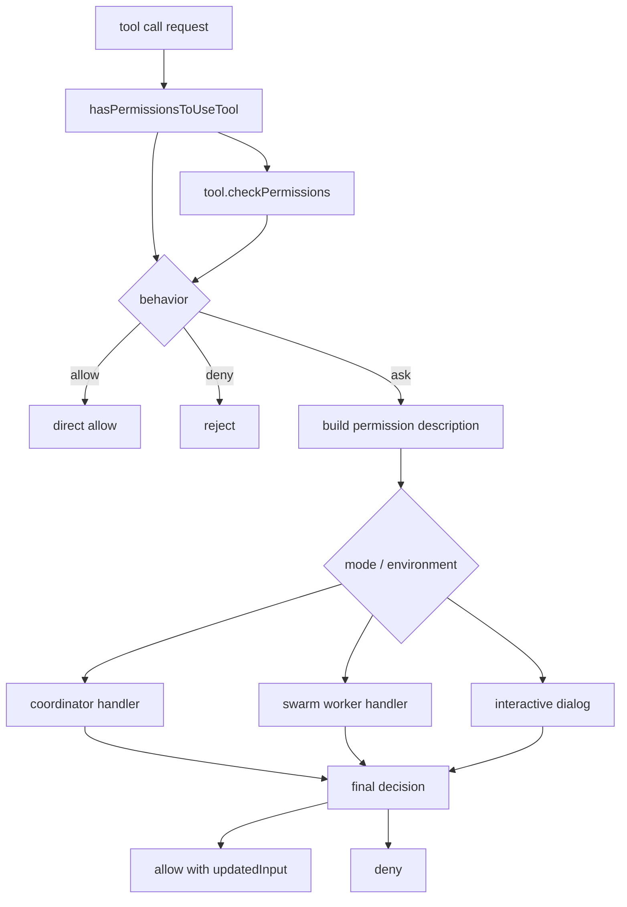
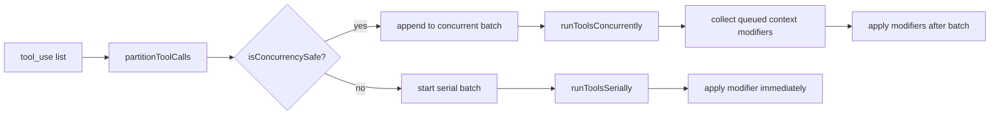
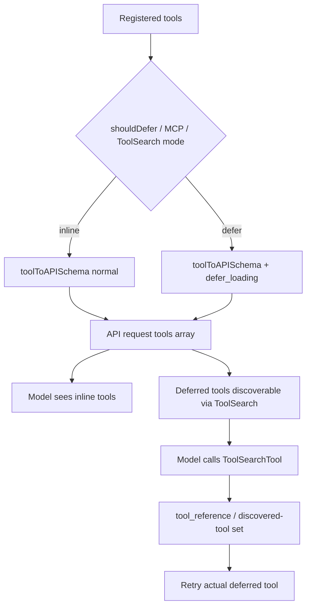
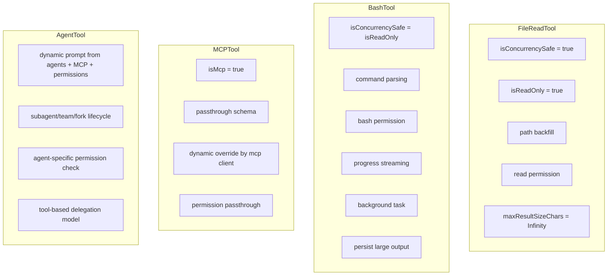

# Claude Code Tools 设计分析

## 1. 结论

Claude Code 的 `tools` 不是一个简单的函数注册表，而是一套统一的能力运行时协议。它把同一个 tool 同时投影到四个面：

- 模型侧：tool schema、prompt、strict、defer loading
- 执行侧：参数校验、调用、进度、结果、中断
- 权限侧：全局规则、工具特化规则、交互确认
- UI 侧：tool use、progress、result、error、grouped render

核心抽象集中在：

- `/Users/jishihe/work/civil-engineering-cloud-claude-code-source-v2.1.88/01-claude-code-source-crack/claude-code-source/src/Tool.ts`
- `/Users/jishihe/work/civil-engineering-cloud-claude-code-source-v2.1.88/01-claude-code-source-crack/claude-code-source/src/services/tools/toolExecution.ts`
- `/Users/jishihe/work/civil-engineering-cloud-claude-code-source-v2.1.88/01-claude-code-source-crack/claude-code-source/src/services/tools/toolOrchestration.ts`
- `/Users/jishihe/work/civil-engineering-cloud-claude-code-source-v2.1.88/01-claude-code-source-crack/claude-code-source/src/hooks/useCanUseTool.tsx`
- `/Users/jishihe/work/civil-engineering-cloud-claude-code-source-v2.1.88/01-claude-code-source-crack/claude-code-source/src/utils/api.ts`
- `/Users/jishihe/work/civil-engineering-cloud-claude-code-source-v2.1.88/01-claude-code-source-crack/claude-code-source/src/utils/toolSearch.ts`

---

## 2. 总体架构图

这个图表达的重点是：`Tool` 不是只服务执行器，而是四条链路共享的合同对象。

---

## 3. Tool 对象结构图

`Tool` 接口定义在 `Tool.ts`，`buildTool()` 负责补全默认实现。默认值明显偏 fail-closed：

- `isConcurrencySafe -> false`
- `isReadOnly -> false`
- `isDestructive -> false`
- `toAutoClassifierInput -> ''`

这里的设计意图很明确：tool 的定义阶段就把“执行、权限、UI、模型暴露”全部收拢，而不是散落在多个 registry 中。

---

## 4. 执行时序图

执行主链路从 `runTools()` 到 `runToolUse()` 再到 `checkPermissionsAndCallTool()`。

链路被拆成三类关口：

- 结构校验：`inputSchema.safeParse()`
- 语义校验：`validateInput()`
- 权限校验：`canUseTool()` + `checkPermissions()`

这样做的好处是错误原因能被准确归类，模型也更容易修正下一次调用。

---

## 5. 权限设计图

权限系统不是单一 `allow/deny` 开关，而是“全局规则 + 工具特化 + 交互流程”的组合。

关键点：

- 全局系统负责统一规则匹配
- 每个工具保留 `checkPermissions()`，处理自己才懂的语义
- `updatedInput` 允许权限层改写调用参数
- Bash 还接了 classifier 和 speculative check

这能避免把所有工具差异都堆进一个巨大的统一权限函数里。

---

## 6. 并发与批处理图

并发不是“统一线程池策略”，而是每个 tool 自己声明 `isConcurrencySafe(input)`，由编排器按调用顺序动态分组。

这套设计的特点：

- 并发安全是 tool 自声明，不是 orchestration 硬编码
- 非安全工具串行，避免状态冲突
- 并发批次内的 `contextModifier` 延迟到批次完成后统一应用

这说明作者把“调度语义”也纳入了 tool contract。

---

## 7. ToolSearch / Deferred Loading 图

这部分是这套架构比较成熟的一点。工具太多时，问题不再是“支不支持 tool”，而是“是否值得在首轮 prompt 暴露全部 schema”。

关键实现点：

- `toolToAPISchema()` 负责把 `Tool` 转成 API schema
- `strict`、`eager_input_streaming`、`cache_control`、`defer_loading` 都在这里统一处理
- `getToolSearchMode()` 和 token/char threshold 控制是否启用动态工具加载

这个设计解决了两个问题：

- prompt 太大
- MCP / 扩展工具太多时首轮 schema 暴露成本过高

---

## 8. 典型工具对比图

四个工具分别体现了不同设计重点：

- `FileReadTool`：安全读取和上下文控制
- `BashTool`：受控任务执行系统
- `MCPTool`：外部能力适配模板
- `AgentTool`：把子 agent 调度也纳入 tool 协议

---

## 9. 分层职责表

| 层 | 主要对象 | 解决的问题 |
|---|---|---|
| 抽象层 | `Tool`, `ToolDef`, `buildTool` | 统一描述 tool 的能力、权限、UI、模型暴露 |
| API 映射层 | `toolToAPISchema`, ToolSearch | 把本地 tool 转成模型能消费的 schema，控制 prompt 成本 |
| 编排层 | `runTools`, `partitionToolCalls` | 基于 tool 声明的并发属性做批处理 |
| 执行层 | `runToolUse`, `checkPermissionsAndCallTool` | 完成 lookup、校验、权限、执行、结果回写 |
| 权限层 | `hasPermissionsToUseTool`, `tool.checkPermissions` | 统一权限规则与工具专属规则组合 |
| 具体工具层 | `FileReadTool`, `BashTool`, `MCPTool`, `AgentTool` | 实现各类能力的具体运行逻辑 |
| 表现层 | render / extract / grouping APIs | 让工具结果对用户可见、可检索、可折叠 |

---

## 10. 设计优点与代价

### 优点

- 一个 tool 对象就能覆盖模型、执行、权限、UI 四个面
- `buildTool()` 提供保守默认值，安全边界清晰
- 并发是声明式的，扩展新工具成本低
- 权限支持工具特化，不会退化成全局 `switch(tool.name)`
- ToolSearch 明确把 prompt budget 当成系统级问题处理

### 代价

- `Tool` 接口很重，接入新工具需要理解的维度较多
- UI 渲染逻辑和执行协议耦合在同一个对象中，抽象不够纯
- 重工具如 `BashTool`、`AgentTool` 已经接近子系统复杂度
- feature flag、provider、model 能力会影响行为，阅读成本高

---

## 11. 一句话总结

Claude Code 的 `tools` 设计本质上是一套“统一能力运行时协议”。  
它并不是把模型调用转发给几个本地函数，而是把 schema、权限、执行、并发、UI 和 transcript 统一建模为同一个 Tool 合同。
