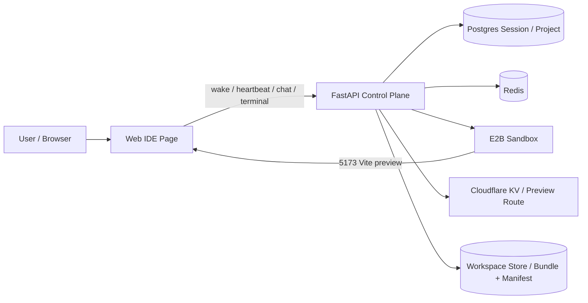
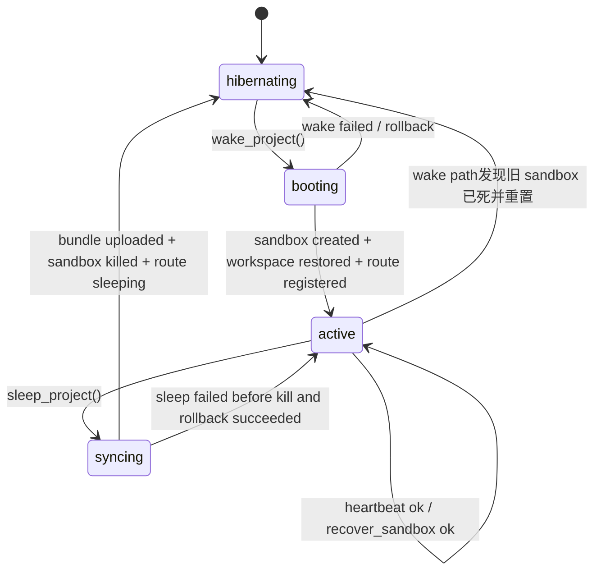
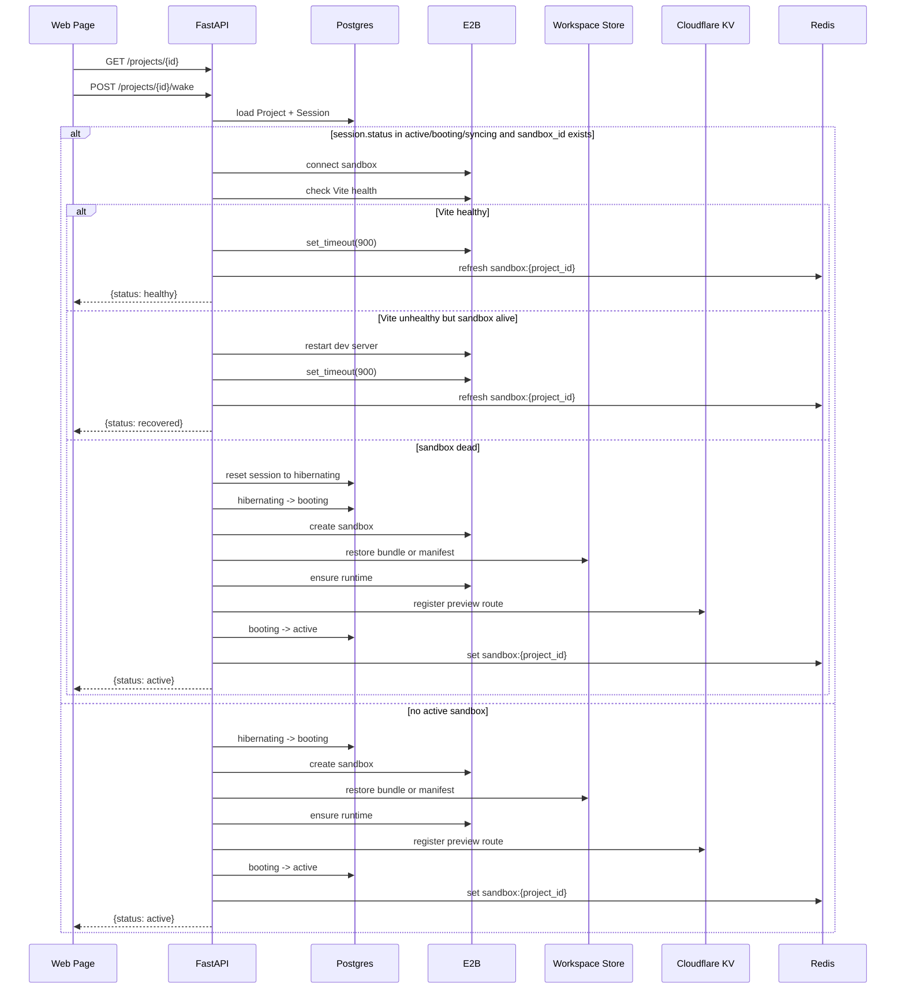
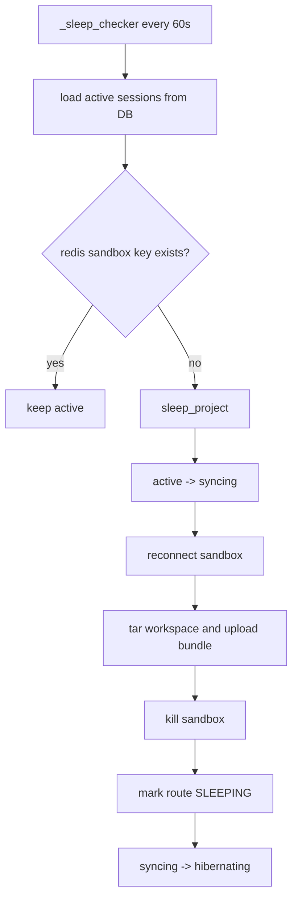

# 当前 Sandbox 生命周期说明

本文描述当前 `tipsy-studio` 中 sandbox 生命周期的真实实现，以当前代码为准。

核心目标有两个：
- 启动尽量快：优先复用已有 sandbox，恢复 workspace 时尽量走模板依赖快路径，避免不必要的 `npm install`
- 不反复掉线：前端只在页面可见时保活，后端统一做探活和恢复，只有确认 sandbox 已死才重建

## 1. 总体结构图

## 2. 生命周期参与者

- 前端 IDE 页
  - 初次进入项目时调用 `GET /projects/{id}` 和 `POST /projects/{id}/wake`
  - `active` 状态下按需触发 `heartbeat`
  - 只在页面可见时保活
  - 页面重新可见、窗口 focus、用户活动时优先做轻量恢复

- 后端 `sandbox_service`
  - 统一管理 create / wake / recover / heartbeat / sleep
  - 统一判断当前 sandbox 是：
    - `healthy`
    - `dev_server_recovered`
    - `dead_unrecoverable`

- Postgres `Session`
  - 保存项目当前 session 的生命周期状态
  - 关键字段：
    - `status`
    - `e2b_sandbox_id`
    - `version`

- Redis
  - `lock:lifecycle:{project_id}`：生命周期互斥锁
  - `sandbox:{project_id}`：当前活跃 sandbox 标记
  - 当前 TTL 为 15 分钟

- E2B sandbox
  - 真正运行 Node/Vite/workspace 的环境
  - 通过 `set_timeout(900)` 延长存活时间

- Cloudflare KV
  - 保存预览路由到 sandbox 的映射
  - 唤醒成功后写入最新预览地址
  - 休眠后写成 `SLEEPING`

- Workspace Store
  - 保存 workspace manifest 和 bundle
  - 唤醒时从 bundle 或 manifest 恢复代码
  - 休眠时打包并上传 bundle

## 3. 状态机

当前后端 session 状态主要有：
- `hibernating`
- `booting`
- `active`
- `syncing`

补充说明：
- `wake` 路由如果发现 DB 里还是 `active/booting/syncing` 且存在 `e2b_sandbox_id`，不会盲目新建 sandbox，而是先走 `recover_sandbox`
- 只有 `recover_sandbox` 返回 `dead_unrecoverable`，才会把 session 重置为 `hibernating` 再重建

## 4. 关键链路

### 4.1 页面首次进入

### 4.2 `wake_project()` 的恢复路径

真实策略不是“恢复后必定 `npm install`”，而是：

1. 创建新 sandbox
2. 优先尝试从当前 workspace version 的 bundle 恢复
3. bundle 失败时退回 manifest 恢复
4. 恢复后判断依赖文件是否和模板一致
5. 如果依赖未变：
   - 直接检查 dev server
   - 能用则不安装依赖
   - 失败时再补做 `npm install + restart`
6. 如果依赖变了：
   - 执行 `npm install`
   - 强制重启 dev server

依赖文件判断范围：
- `package.json`
- `package-lock.json`
- `npm-shrinkwrap.json`
- `pnpm-lock.yaml`
- `yarn.lock`
- `bun.lock`
- `bun.lockb`

### 4.3 Heartbeat / 轻量恢复

当前 `POST /api/projects/{id}/heartbeat` 已经不只是单纯续期。

后端行为：
1. 连接已有 sandbox
2. 检查 Vite 是否健康
3. 如果 Vite 挂了但 sandbox 还活着，直接重启 dev server
4. 如果恢复成功，调用 `set_timeout(900)`
5. 刷新 Redis `sandbox:{project_id}`
6. 返回：
   - `ok`
   - `recovered`
   - `wake_required`

前端行为：
- 固定每 60 秒发一次 heartbeat
- 只有页面 `visible` 时才发
- 在这些事件上额外触发 heartbeat：
  - `visibilitychange` 回到可见
  - `focus`
  - 用户 `pointerdown`
  - 用户 `keydown`
- 如果后端返回 `wake_required`，才进入完整 `wake`
- 不再依赖“连续失败 3 次就重建”的旧策略

### 4.4 Terminal 连接

终端 websocket 现在是独立的一条弱耦合恢复链路：

- 打开 terminal 时连接 `/api/projects/{id}/terminal`
- 断开后会指数退避重连
- 最大重连间隔 15 秒
- 如果是 `4004 No active sandbox`，不继续重连

这意味着 terminal 的短暂断开，不再直接被视为 sandbox 生命周期失败。

## 5. 自动休眠

后端在 `main.py` 中启动 `_sleep_checker()` 后台任务。

行为：
1. 每 60 秒扫描 DB 中所有 `status == active` 的 session
2. 去 Redis 查询 `sandbox:{project_id}`
3. 如果 Redis 标记不存在，但 DB 仍认为 sandbox active，触发 `sleep_project()`

`sleep_project()` 还会做几件保护性动作：
- 先检查 Cloudflare KV 里当前 hostname 指向的 sandbox 是否还是自己
- 如果 route 已经指向新 sandbox，旧 sandbox 会被清理但不会覆盖新状态
- 如果在 kill 前失败，会尽量回滚 DB 状态到 `active`
- 如果已经 kill 成功，再失败时优先补齐 `hibernating + SLEEPING`

## 6. 现在这套实现解决了什么

### 6.1 比旧实现更稳的地方

- `wake` 和 `heartbeat` 共用同一套恢复逻辑
  - 不再是路由层和 service 层两套 Vite 重启逻辑
- heartbeat 会尝试恢复 dev server，而不是一失败就等前端猜测是否重建
- 前端只在页面可见时保活，避免后台 tab 无意义续命
- 页面重新可见时先轻量恢复，减少“刚回来就重新创建 sandbox”
- terminal 自己有重连，不把 websocket 抖动放大成生命周期失败

### 6.2 比旧实现更快的地方

- workspace 恢复后不再默认 `npm install`
- 模板依赖没有变时，直接走快路径
- 真失败才退回安装依赖的补救路径

## 7. 当前仍然存在的瓶颈

从现有日志和实现看，完整重建时主要耗时仍然在：

- `ensure_project_head`
- 创建 E2B sandbox
- bundle 下载和解压
- `npm install`（依赖变更时）
- Cloudflare route 注册

因此当前策略是：
- 优先避免进入完整重建
- 进入重建后再尽量走“免安装依赖”的快路径

## 8. 关键数据与超时

- 生命周期锁：
  - `lock:lifecycle:{project_id}`
  - TTL: `120s`

- sandbox 活跃标记：
  - `sandbox:{project_id}`
  - TTL: `900s`

- E2B timeout：
  - `900s`

- 前端 heartbeat：
  - `60s` 一次

- terminal websocket 重连：
  - 指数退避
  - 上限 `15s`

## 9. 一句话总结

当前 sandbox 生命周期已经从“前端猜测式重建”切成了“后端统一探活恢复 + 15 分钟短时保温 + 依赖按需安装”的模式：

- 能复用就复用
- 能只修 Vite 就只修 Vite
- 能不装依赖就不装依赖
- 只有确认 sandbox 真死了才重建
