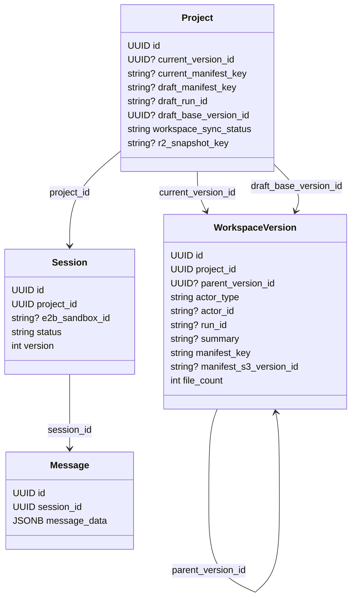
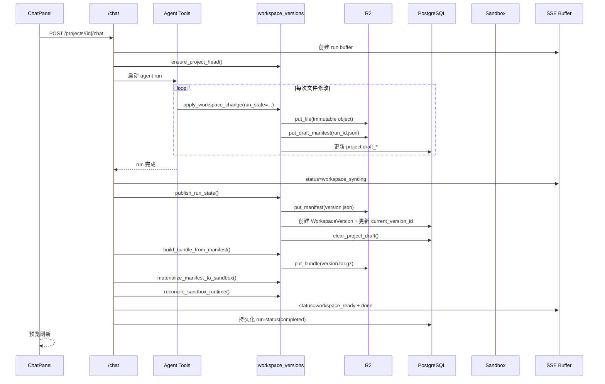
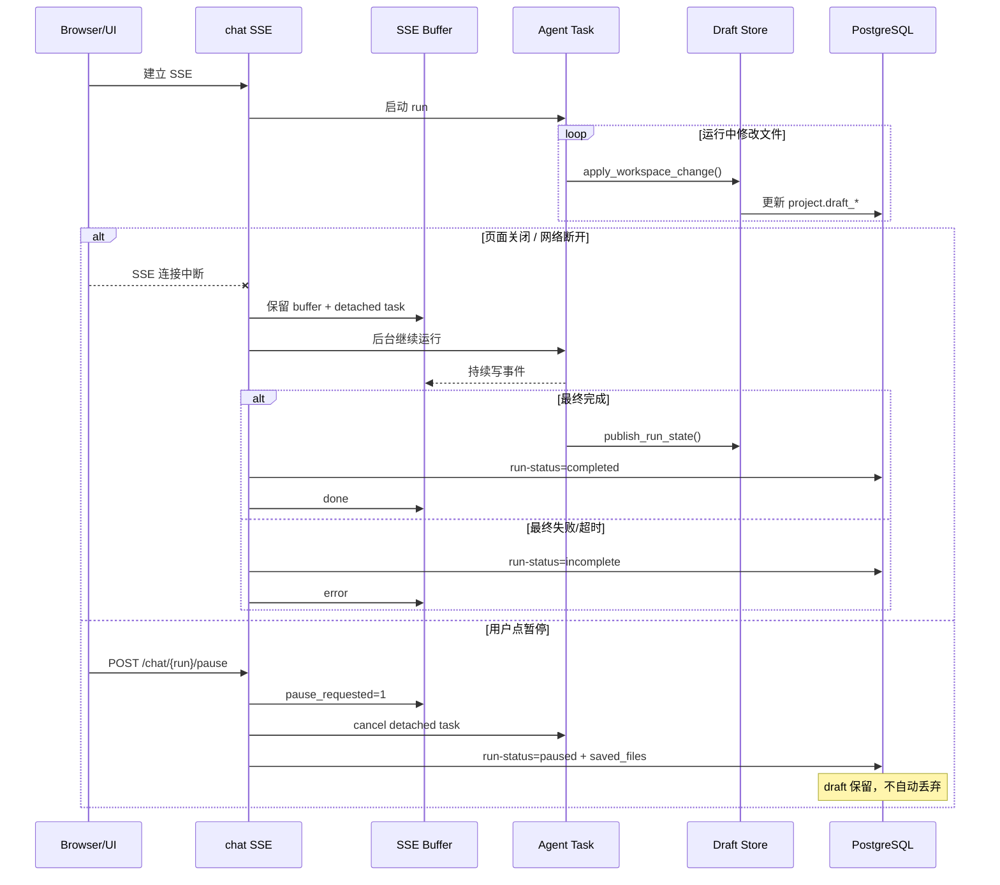
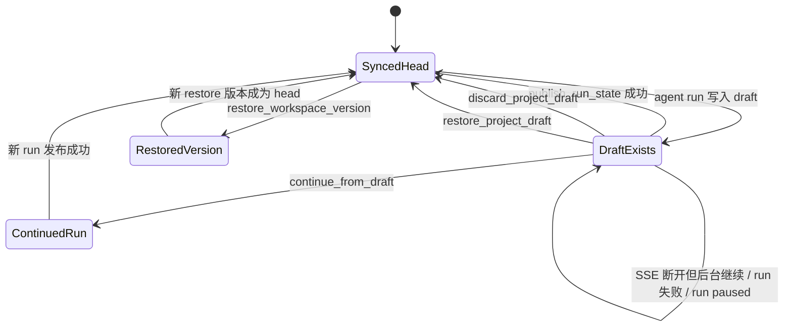
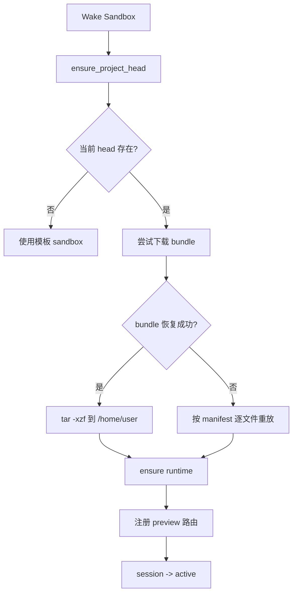

# Tipsy Studio 当前版本管理与数据恢复架构

更新时间：2026-04-06  
范围：基于当前代码实现分析，不沿用旧版设计假设。  
代码基线：`apps/api/services/workspace_versions.py`、`apps/api/services/workspace_store.py`、`apps/api/services/sandbox_service.py`、`apps/api/routers/chat.py`、`apps/api/services/sse_buffer.py`、`apps/web/components/ide/ChatPanel.tsx`、`apps/web/app/project/[id]/page.tsx`

## 1. 结论摘要

当前系统的“代码版本管理”和“数据恢复”不是单一机制，而是三层协作：

1. `WorkspaceVersion + manifest` 是正式版本真相。
2. `Project.draft_*` 是运行中/中断后未发布改动的服务端草稿真相。
3. `sandbox` 是可重建的执行态/预览态，不是长期真相。

当前实现的核心变化点是：

1. Agent 运行过程中，文件改动先写入对象存储中的文件对象，并持续更新服务端 draft manifest。
2. 正常完成时，才把 draft 发布成新的 `WorkspaceVersion`，随后统一推送到 sandbox。
3. 如果中断、断线、暂停或页面关闭，未发布改动不会丢在 sandbox 里，而是保存在服务端 draft 上。
4. sandbox 恢复时优先用当前版本 bundle 快速恢复；bundle 不可用时回退到 manifest 重放。

这意味着当前系统实际上有两个“版本层”：

1. 正式层：`projects.current_version_id -> workspace_versions.manifest_key`
2. 临时层：`projects.draft_manifest_key / draft_run_id / draft_base_version_id`

## 2. 总体架构

```mermaid
flowchart LR
    U[User Browser]
    W[Next.js IDE]
    CP[ChatPanel]
    PP[Project Page]
    API[FastAPI]
    CHAT[chat router]
    WV[workspace_versions service]
    SS[sandbox_service]
    SSE[sse_buffer]
    DB[(PostgreSQL)]
    R[(Redis)]
    R2[(Cloudflare R2)]
    SB[E2B Sandbox]

    U --> W
    W --> CP
    W --> PP

    CP -->|POST /chat| CHAT
    CP -->|GET /chat/resume| CHAT
    CP -->|POST /chat/{run}/pause| CHAT
    CP -->|POST /draft/discard| API
    PP -->|heartbeat / wake| API

    CHAT --> WV
    CHAT --> SSE
    CHAT --> SB
    WV --> DB
    WV --> R2
    SSE --> R
    API --> SS
    SS --> DB
    SS --> R
    SS --> R2
    SS --> SB
    WV --> SB

    DB -->|正式版本指针 + draft 指针 + 会话/消息| API
    R2 -->|文件对象 / manifest / draft manifest / bundle| API
    R -->|SSE事件缓冲 / pause标志| API
    SB -->|预览站点 + 文件系统 + Vite| W
```

### 2.1 组件职责

| 组件 | 职责 |
| --- | --- |
| `workspace_store.py` | 负责 R2 对象读写，存文件对象、manifest、draft manifest、bundle |
| `workspace_versions.py` | 负责 head 初始化、draft 累积、正式发布、版本恢复、sandbox 物化 |
| `chat.py` | 负责 agent run 生命周期、SSE 流、断线后后台续跑、完成后统一发布 |
| `sse_buffer.py` | 负责 Redis 中的可恢复 SSE 事件缓冲、pause 标志、terminal 状态 |
| `sandbox_service.py` | 负责 sandbox 唤醒、休眠、bundle 恢复、manifest 回放、心跳恢复 |
| 前端 `ChatPanel` | 负责发起 run、暂停、continue from draft、discard draft、SSE 重连 |
| 前端 `project/[id]/page.tsx` | 负责 heartbeat、wake、预览刷新节奏 |

## 3. 数据模型与存储模型

### 3.1 数据库核心实体



### 3.2 关键字段如何理解

#### `projects`

| 字段 | 含义 |
| --- | --- |
| `current_version_id` | 当前正式 head 版本 |
| `current_manifest_key` | 当前正式 head 对应 manifest 的快捷指针 |
| `draft_manifest_key` | 当前服务端 draft manifest |
| `draft_run_id` | 这个 draft 属于哪一次 chat run |
| `draft_base_version_id` | 这个 draft 基于哪个正式版本起步 |
| `workspace_sync_status` | 正式版本与 sandbox 是否同步成功 |
| `r2_snapshot_key` | 历史迁移遗留字段，作为旧 R2 快照回退来源 |

#### `workspace_versions`

| 字段 | 含义 |
| --- | --- |
| `id` | 版本 ID |
| `parent_version_id` | 父版本 |
| `actor_type` | 版本来源，如 `agent`、`restore`、`migration`、`draft-restore` |
| `run_id` | 若版本来自某次 agent run，可回溯 run |
| `manifest_key` | 版本 manifest 在 R2 上的位置 |
| `manifest_s3_version_id` | 旧对象版本化思路遗留字段，当前主链路基本不依赖 |

### 3.3 R2 对象布局

当前 workspace 对象存储已经按 R2 使用，路径规则如下：

| 类型 | Key 规则 | 作用 |
| --- | --- | --- |
| 文件对象 | `projects/{project_id}/files/{sha256}/{filename}` | 不可变文件内容对象 |
| 正式版本 manifest | `projects/{project_id}/versions/{workspace_version_id}.json` | 版本文件索引 |
| draft manifest | `projects/{project_id}/drafts/{run_id}.json` | 运行中的服务端草稿索引 |
| 版本 bundle | `projects/{project_id}/bundles/{workspace_version_id}.tar.gz` | sandbox 快速恢复用打包快照 |

### 3.4 Manifest 结构

当前 manifest 是版本真相，不靠对象存储版本号回滚，而是靠 manifest 指向不可变文件对象：

```json
{
  "version_id": "workspace-version-id",
  "project_id": "project-id",
  "parent_version_id": "parent-version-id-or-null",
  "actor_type": "agent",
  "actor_id": "session-id-or-null",
  "run_id": "chat-run-id-or-null",
  "created_at": "2026-04-06T00:00:00Z",
  "summary": "Workspace update",
  "files": {
    "src/App.tsx": {
      "key": "projects/.../files/<sha256>/App.tsx",
      "etag": "...",
      "sha256": "...",
      "size": 1234,
      "content_type": "text/tsx"
    }
  }
}
```

## 4. 真相源与一致性规则

### 4.1 哪个层才是真相

#### 正常稳定态

正式真相是：

1. `projects.current_version_id`
2. `workspace_versions.manifest_key`
3. manifest 指向的 R2 文件对象

#### Run 进行中或异常中断后

临时真相是：

1. `projects.draft_manifest_key`
2. `projects.draft_run_id`
3. 对应 draft manifest 指向的 R2 文件对象

#### sandbox

sandbox 是物化态，不是最终真相：

1. 它可能落后于 draft
2. 它可能因为休眠而消失
3. 它可以从 bundle 或 manifest 重新构建

### 4.2 一致性策略

1. Agent 修改文件时，先写 R2 文件对象，再更新 draft manifest，再提交 DB 中的 draft 指针。
2. 正式发布时，读取 draft/base manifest，生成新的正式 manifest 和 `WorkspaceVersion`，再更新 `projects.current_version_id`。
3. sandbox 更新始终是“发布之后”的物化行为，而不是版本真相本身。
4. SSE 中断不影响后台 run 持续推进，因为 run 生命周期和 HTTP 连接解耦。

## 5. 核心流程

### 5.1 Head 初始化 / 老数据迁移

当项目还没有 `current_version_id` 时，系统会在第一次访问 head 时执行 `ensure_project_head(...)`：

1. 优先从当前活跃 sandbox 读工作区
2. 失败则尝试 `project.r2_snapshot_key` 指向的历史 bundle
3. 再失败则从旧 `file_snapshots` 回放
4. 把读出的文件逐个写入 R2 文件对象
5. 生成一个 `actor_type="migration"` 的 Genesis 版本

这一步把旧数据统一收敛到“manifest + immutable file objects”的新模型。

### 5.2 正常 Agent Run



### 5.3 Run 中的“读”和“写”不是同一条路径

这是当前设计里最容易误解的一点：

1. `create_file/edit_file/delete_file` 在 run 中默认只落服务端 draft，不直接写 sandbox。
2. `view_file` 读文件时，会优先读 `run_state.pending_contents` 或 draft manifest，再退回正式 head，再退回 sandbox。
3. 某些依赖 sandbox 的只读工具，例如 `list_dir`、`search_code`、`get_dev_server_logs`，在 `continue_from_draft` 模式下会先把 draft 物化到 sandbox 一次，再执行读取。

因此当前不是“完全不碰 sandbox”，而是：

1. 写路径：默认延迟到发布阶段
2. 读路径：必要时按需把 draft 物化到 sandbox

### 5.4 中断、断线、暂停、页面关闭



### 5.5 前端恢复策略

前端恢复其实有两层：

#### SSE 流恢复

1. 初始 `POST /chat` 返回 `X-Chat-Run-Id`
2. 浏览器流断开后，前端用 `GET /chat/resume/{run_id}?last_event_id=...` 继续追尾
3. Redis buffer 用 `last_event_id` 补事件

#### 工作区恢复

1. 如果 run 未完成但 draft 已保存，消息列表里的 run-status 会带 `saved_files`
2. `ChatPanel` 会显示 “continue / discard” 提示
3. `continue` 不是直接调用 `/draft/restore`，而是发起新的 chat：
   - `continue_from_draft=true`
   - `continuation_run_id=<上次 draft_run_id>`
4. 后端把新的 agent prompt 改写为“继续上次中断任务，不要重头开始”
5. 新 run 读取工作区时会把服务端 draft 视为当前工作区状态

### 5.6 显式恢复路径



三条显式恢复链路：

1. `continue_from_draft`
   - 目标：从中断点继续 agent 工作
   - 特点：保留 draft，不立即变正式版本
2. `POST /projects/{id}/draft/restore`
   - 目标：直接把 draft 提升为正式版本
   - 特点：会创建新的 `WorkspaceVersion`，并推送到 sandbox
3. `POST /projects/{id}/versions/{version_id}/restore`
   - 目标：把历史正式版本恢复为新的 head
   - 特点：会生成新的 `restore` 版本，而不是把旧版本直接改成 current

### 5.7 discard draft

`discard_project_draft(...)` 的逻辑是：

1. 读取当前 head manifest
2. 如果有 sandbox，则把 head 重新物化回 sandbox
3. 清理 `project.draft_manifest_key / draft_run_id / draft_base_version_id`

所以 discard 的语义是“回到正式 head”，不是“删除部分文件差异”。

## 6. Sandbox 数据恢复架构

这一部分是当前恢复设计里非常关键的一层。

### 6.1 唤醒时的恢复顺序



具体实现：

1. `sandbox_service.wake` 先 `ensure_project_head`
2. 如果当前 head 存在，优先尝试下载 `projects/{project_id}/bundles/{head_version_id}.tar.gz`
3. bundle 恢复成功则直接解压到 `/home/user`
4. bundle 不存在或恢复失败，则回退到 `materialize_manifest_to_sandbox(...)`
5. 完成后执行 runtime 校验/重启，确保 Vite 可用

### 6.2 休眠时的 bundle 归档

当前版本 bundle 并不完全依赖“发布时立刻生成”，还存在休眠归档补偿机制：

1. sandbox 进入 sleep 时会检查当前 head 的 bundle 是否已存在
2. 如果不存在，会在 sandbox 内打 `tar.gz`
3. 然后通过预签名 URL 上传到 R2

这意味着：

1. bundle 是恢复加速产物，不是版本真相本身
2. 某些版本在刚创建后不一定立刻已经有 bundle
3. 但当 sandbox 正常进入休眠流程时，系统会尽量补齐当前 head 的 bundle

### 6.3 心跳与页面关闭

前端项目页会：

1. 每 60 秒发送 heartbeat
2. 页面可见、聚焦、用户活动时也触发 heartbeat

`heartbeat()` 内部调用 `recover_sandbox(..., extend_timeout=True)`，返回：

1. `ok`：sandbox 健康
2. `recovered`：dev server 刚恢复完成，前端应刷新预览
3. `wake_required`：需要重新 wake

页面关闭时：

1. heartbeat 停止
2. sandbox 不会立刻消失，只是不再被前端持续续命
3. 如果之后进入休眠，重新打开页面会走 wake + bundle/manifest 恢复

## 7. 聊天消息与恢复提示链路

### 7.1 Run 状态如何落库

每次 run 最终都会在 `messages` 表里追加一个 `kind = "run-status"` 的消息，携带：

1. `status`: `completed` / `paused` / `incomplete`
2. `saved_files`
3. `ended_at`
4. `error`

同时，流式进行中会周期性写 `response-snapshot`，带 `last_event_id`，供 SSE 恢复使用。

### 7.2 前端如何判断“可恢复”

前端的判断依据不是单一字段，而是组合：

1. run-status 不是 `completed`
2. 有 `resume_event_id` 或保存的 `saved_files`
3. 项目接口返回 `has_draft`

因此 UI 上的“恢复/丢弃”提示，本质上是在提示：  
这个项目当前还挂着一个服务端 draft。

## 8. 当前架构的优点

1. 正式版本与运行中改动分离，避免 agent 半成品直接污染 preview。
2. draft 先落服务端，页面关闭、SSE 断开、用户暂停都不会直接丢代码。
3. manifest 指向不可变文件对象，回滚和 diff 逻辑简单明确。
4. sandbox 可以被视为可重建缓存，恢复路径清晰。
5. bundle + manifest 双路径恢复，兼顾启动速度和兜底可靠性。

## 9. 当前架构的限制与风险

### 9.1 Draft 是单项目单槽位

当前 `Project` 只有一组 `draft_*` 字段，因此一个项目同一时刻只能挂一个 draft。  
这会限制未来的并行 run 或多分支草稿能力。

### 9.2 continue_from_draft 不是“事务恢复”

当前 continuation 的语义是：

1. 新开一个 run
2. 用旧 draft 作为工作区基线
3. 让模型继续做剩余工作

它不是恢复原始模型推理上下文，也不是恢复工具调用栈。

### 9.3 Draft 恢复对空工作区边界不稳

当前 `restore_project_draft()` 通过 `publish_run_state()` 提升 draft。  
但 `publish_run_state()` 一开始会检查：

1. `changed_files`
2. `deleted_paths`
3. `pending_contents`

如果 draft 表示“空工作区”而这些集合为空，就会直接返回 `None`。  
因此当前实现下，空 manifest draft 的 restore 语义并不完整。

### 9.4 仍有历史兼容字段

以下字段还存在，但已不是主链路核心：

1. `WorkspaceVersion.manifest_s3_version_id`
2. `Project.r2_snapshot_key`
3. `file_snapshots` 表

它们目前更多承担兼容/迁移兜底职责。

### 9.5 bundle 不是绝对同步生成

当前代码里：

1. 正常 agent 发布会立即 build bundle
2. `draft/restore` 也会 build bundle
3. `restore_workspace_version` 生成的新 restore 版本本身不在该函数内立即 build bundle
4. 但 sandbox 休眠时会尝试为当前 head 补齐 bundle

所以“每个版本创建瞬间都必有 bundle”在当前实现里不是强保证。

### 9.6 sandbox 物化仍是逐文件重放

`materialize_manifest_to_sandbox(...)` 目前按文件逐个写入 `/home/user`。  
这意味着推送正式代码到 sandbox 期间，运行态可能经历一个过渡过程；只是这个过程已经被延迟到 run 结束以后。

## 10. 建议如何理解当前架构

如果用一句话概括当前设计，可以这样理解：

> 正式版本靠 manifest 管历史，运行中改动靠 draft 管中间态，sandbox 只负责执行和预览，丢了就按 bundle/manifest 重建。

更具体一点：

1. `WorkspaceVersion` 解决的是“可追溯的正式版本管理”
2. `draft` 解决的是“agent run 中断后的数据保留与继续编辑”
3. `SSE buffer` 解决的是“流连接断了但 run 还在继续”
4. `bundle + manifest restore` 解决的是“sandbox 丢了以后如何快速恢复代码”

这四层叠起来，才构成当前完整的版本管理与数据恢复架构。

## 11. 后续如果继续优化，建议抓手

如果未来继续优化，但仍希望改动小，最值得优先看的点是：

1. 把 draft 从 `Project` 单槽位升级成独立表，支持多 draft / 更清晰生命周期。
2. 明确 bundle 的生成时机，变成对所有 head 版本都可预期。
3. 让 `restore_project_draft` 正确支持空 manifest draft。
4. 如果要进一步减少 preview 过渡抖动，需要优化 sandbox 物化策略，而不是只改聊天链路。

