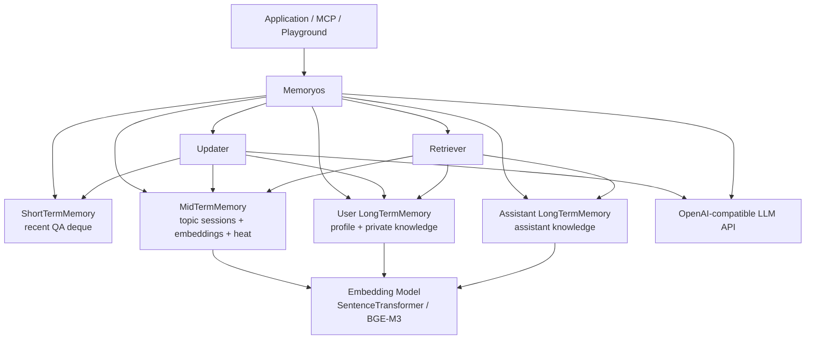
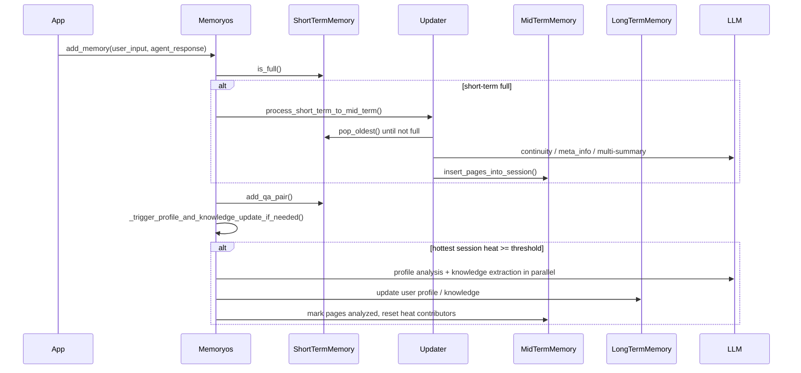
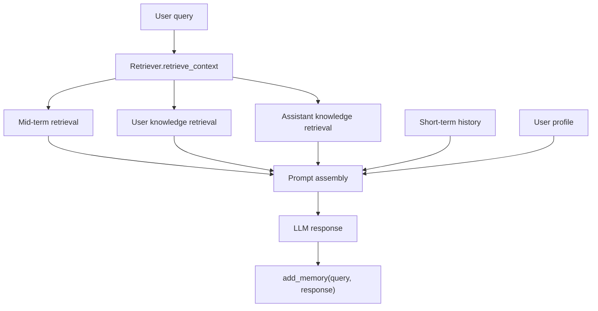

本文基于 `/Users/jishihe/work/MemoryOS` 当前代码梳理，重点不是复述 README，而是回答三个问题：

- MemoryOS 解决的核心问题是什么
- 代码如何把短期、中期、长期记忆组织成一条可运行链路
- PyPI、ChromaDB、MCP、Playground、评测代码分别处在什么位置

## 1. 架构结论

MemoryOS 是一个面向个性化 AI Agent 的**分层记忆运行时**。它不是单纯的向量检索库，也不是完整聊天应用，而是把对话记忆拆成短期、中期、长期三层，再围绕这三层提供更新、检索和生成能力。

当前仓库可以理解成五个部分：

1. `memoryos-pypi`
   主实现，也是最清晰的核心库版本。存储主要依赖 JSON 文件，向量检索使用 FAISS。
2. `memoryos-chromadb`
   ChromaDB 存储替换版，把中期记忆和长期知识从 JSON + FAISS 的临时索引迁移到持久化向量库。
3. `memoryos-mcp`
   MCP Server 包装层，把核心能力暴露给 Claude Desktop、Cursor、Cline 等 Agent Client。
4. `memoryos-playground`
   Flask Demo，用于可视化体验记忆写入、对话、分析触发和记忆状态查看。
5. `eval`
   LoCoMo 评测和复现实验代码，用来验证记忆检索与回答效果。

核心设计可以用一句话概括：

> 每轮对话先进入短期记忆；短期满了以后被摘要、聚类、嵌入并提升为中期 session；被频繁访问或交互量较高的中期记忆会触发长期画像和知识更新；生成回答时同时读取短期上下文、中期相关页面、用户长期知识和助手长期知识。

## 2. 顶层结构

```text
MemoryOS/
  README.md
  readme_cn.md
  Dockerfile

  memoryos-pypi/
    memoryos.py        核心编排类 Memoryos
    short_term.py      短期记忆
    mid_term.py        中期记忆
    long_term.py       长期记忆
    updater.py         记忆提升与分析
    retriever.py       并行检索
    utils.py           LLM、embedding、并行工具
    prompts.py         LLM prompt 模板

  memoryos-chromadb/
    storage_provider.py  ChromaDB 存储适配器
    ...                  与 pypi 版本相似的核心模块

  memoryos-mcp/
    server_new.py      FastMCP server
    config.json        MCP 运行配置
    mcp.json           MCP client 配置示例
    memoryos/          内嵌核心库副本

  memoryos-playground/
    memdemo/app.py     Flask demo 后端
    memdemo/templates/ 前端页面

  eval/
    main_loco_parse.py       LoCoMo 数据处理和实验主流程
    retrieval_and_answer.py  评测版检索与回答
    evalution_loco.py        F1 计算
    locomo10.json            样例数据
```

这个仓库没有统一的 monorepo 包管理层。各个目录基本是可独立运行的 Python 子项目，依赖通过各自的 `requirements.txt` 管理。

## 3. 核心模块关系

`memoryos-pypi/memoryos.py` 中的 `Memoryos` 是系统入口。初始化时它会创建：

- `OpenAIClient`
- `ShortTermMemory`
- `MidTermMemory`
- `LongTermMemory`，用户侧
- `LongTermMemory`，助手侧
- `Updater`
- `Retriever`

关系如下：



需要注意的是，`LongTermMemory` 这个类同时支持用户知识和助手知识，但在主编排里实例化了两份：

- `users/{user_id}/long_term_user.json`
- `assistants/{assistant_id}/long_term_assistant.json`

这样可以让“用户画像与私有知识”和“助手自身可复用知识”分开演进。

## 4. 数据存储模型

### 4.1 目录布局

默认 JSON 版本的数据路径由 `data_storage_path` 决定。初始化后大致是：

```text
{data_storage_path}/
  users/
    {user_id}/
      short_term.json
      mid_term.json
      long_term_user.json
  assistants/
    {assistant_id}/
      long_term_assistant.json
```

### 4.2 短期记忆

`ShortTermMemory` 是一个固定容量 `deque`，每条记录是一个 QA 对：

```json
{
  "user_input": "...",
  "agent_response": "...",
  "timestamp": "2026-05-28 12:00:00"
}
```

它的特点是：

- 结构简单
- 每次追加后立即保存
- 满容量时不直接丢弃，而是在 `Memoryos.add_memory()` 中先触发 `Updater.process_short_term_to_mid_term()`

代码里有一个关键修复注释：先迁移旧数据再追加新数据，避免 `deque(maxlen=...)` 自动挤掉最老元素造成静默丢失。

### 4.3 中期记忆

`MidTermMemory` 负责把一批短期 QA 组织成 topic session。一个 session 包含：

- `summary`
- `summary_keywords`
- `summary_embedding`
- `details`
- `N_visit`
- `L_interaction`
- `R_recency`
- `H_segment`
- `last_visit_time`
- `access_count_lfu`

其中 `details` 是 page 列表，每个 page 对应一轮或一段对话：

```json
{
  "page_id": "page_xxx",
  "user_input": "...",
  "agent_response": "...",
  "timestamp": "...",
  "page_embedding": [0.1, 0.2],
  "page_keywords": [],
  "pre_page": null,
  "next_page": null,
  "meta_info": "...",
  "analyzed": false
}
```

中期记忆有三个职责：

1. 用 session 摘要承载主题级检索。
2. 用 page embedding 承载细粒度对话检索。
3. 用热度 `H_segment` 决定哪些记忆值得提升为长期画像或知识。

热度计算在 `compute_segment_heat()` 中：

```text
H_segment = alpha * N_visit + beta * L_interaction + gamma * R_recency
```

`R_recency` 由时间衰减计算，`N_visit` 在检索命中时增加，`L_interaction` 由 session 内页面数量贡献。

### 4.4 长期记忆

`LongTermMemory` 存三类东西：

- `user_profiles`
- `knowledge_base`
- `assistant_knowledge`

用户长期记忆主要使用：

- `user_profiles[user_id].data`
- `knowledge_base`

助手长期记忆主要使用：

- `assistant_knowledge`

知识条目会在写入时生成 embedding，检索时临时构建 `faiss.IndexFlatIP` 做内积相似度搜索。

## 5. 写入链路

应用层调用：

```python
memoryos.add_memory(user_input, agent_response)
```

主流程如下：



这里有两个关键设计点。

第一，短期到中期的提升不是简单搬运，而是 LLM 辅助结构化：

- `check_conversation_continuity()` 判断前后 page 是否连续
- `generate_page_meta_info()` 生成对话链概览
- `gpt_generate_multi_summary()` 生成多主题摘要和关键词
- `insert_pages_into_session()` 根据主题相似度决定合并旧 session 还是创建新 session

第二，中期到长期的提升是热度驱动的：

- 只看当前 heap 中最热的 session
- 只分析 `analyzed = false` 的 page
- 用户画像分析和知识抽取并行执行
- 分析完成后重置该 session 的访问数和交互贡献

这使系统避免每轮对话都更新长期记忆，减少 LLM 调用成本，也降低画像被短期噪声污染的概率。

## 6. 检索与回答链路

应用层调用：

```python
memoryos.get_response(query)
```

主流程如下：



`Retriever.retrieve_context()` 会并行做三类检索：

1. 中期记忆检索：
   - 先用 session summary embedding 找相关 session
   - 再在 session 内用 page embedding 找相关 page
   - 用小顶堆保留前 `retrieval_queue_capacity` 个 page
2. 用户长期知识检索：
   - 从用户 `knowledge_base` 中按 embedding 相似度召回
3. 助手长期知识检索：
   - 从助手 `assistant_knowledge` 中按 embedding 相似度召回

然后 `Memoryos.get_response()` 组装：

- 短期历史
- 中期历史记忆
- 用户画像
- 用户相关知识
- 助手相关知识
- 当前 conversation metadata
- relationship/style 参数

最终通过 `OpenAIClient.chat_completion()` 调用 OpenAI-compatible Chat Completions API。回答生成后，会再次调用 `add_memory()` 把本轮问答写回记忆系统。

## 7. LLM 与 Embedding 适配

`utils.py` 做了两个重要抽象。

### 7.1 OpenAI-compatible LLM

`OpenAIClient` 直接使用 `openai.OpenAI(api_key, base_url)`，所以它并不只支持 OpenAI 官方服务。只要兼容 Chat Completions 接口，就可以接入：

- OpenAI
- DeepSeek
- Qwen
- vLLM
- 其他 OpenAI-compatible endpoint

代码还会清理 `<think>...</think>` 标签，用来适配部分推理模型输出。

### 7.2 Embedding 模型

`get_embedding()` 支持两条路径：

- `SentenceTransformer`
- `FlagEmbedding.BGEM3FlagModel`

默认模型是 `all-MiniLM-L6-v2`。如果模型名包含 `bge-m3`，会走 BGE-M3 分支，并在 `Memoryos.__init__()` 中默认设置 `use_fp16=True`。

Embedding 模型和 embedding 结果都有进程内缓存：

- `_model_cache`
- `_embedding_cache`

缓存降低重复编码成本，但这也意味着长时间服务进程需要关注内存增长。代码目前在 embedding cache 超过 10000 条时清理最早 1000 条。

## 8. ChromaDB 版本

`memoryos-chromadb/storage_provider.py` 引入 `ChromaStorageProvider`，目标是替换 JSON 文件和 FAISS 临时索引。

它创建三个 collection：

```text
mid_term_memory_user_{user_id}
user_knowledge_{user_id}
assistant_knowledge_{assistant_id}
```

同时保留一个 JSON metadata 文件：

```text
metadata_{user_id}_{assistant_id}.json
```

ChromaDB 存：

- session summary embedding
- page embedding
- user knowledge embedding
- assistant knowledge embedding

metadata JSON 存：

- short-term memory
- mid-term sessions 的结构化备份
- user profiles
- access frequency
- heap state
- update times

这个版本的方向是正确的：向量检索交给数据库，非向量状态保留在 metadata 中。但它也带来一致性问题：Chroma collection 和 metadata JSON 是两套持久化系统，代码里没有事务边界。如果某次写入 collection 成功但 metadata 保存失败，或者反过来，就可能出现状态不一致。

## 9. MCP Server

`memoryos-mcp/server_new.py` 用 `FastMCP("MemoryOS")` 暴露三个工具：

- `add_memory`
- `retrieve_memory`
- `get_user_profile`

启动时通过 `--config` 读取配置，然后初始化全局 `memoryos_instance`。MCP client 通过 stdio 与 server 通信。

它的定位不是另一个 MemoryOS 实现，而是一个适配层：

```text
Agent Client -> MCP stdio -> server_new.py -> Memoryos
```

因此 MCP 模式下的核心行为仍由 `memoryos-mcp/memoryos/` 里的 MemoryOS 副本决定。

需要注意两个工程问题：

- `memoryos-mcp/memoryos/` 是核心库副本，不是引用 `memoryos-pypi`。多副本会增加改动漂移风险。
- `server_new.py` 使用全局单例 `memoryos_instance`，适合单用户或本地 agent client，不适合多租户服务端直接复用。

## 10. Playground

`memoryos-playground/memdemo/app.py` 是 Flask demo，提供：

- `/init_memory`
- `/chat`
- `/memory_state`
- `/trigger_analysis`
- `/personality_analysis`
- `/clear_memory`
- `/import_conversations`

它通过浏览器表单收集：

- user id
- api key
- base url
- model name

然后为每个 Flask session 创建一个 `Memoryos` 实例，保存在进程内 `memory_systems` 字典中。

这个实现适合演示，不适合生产：

- Flask 进程重启会丢失内存中的 session 映射
- API key 存在 Flask session 中
- 多进程部署时 `memory_systems` 不共享
- embedding 模型路径写死为 `/root/autodl-tmp/...`

但作为体验 MemoryOS 行为的可视化入口，它很直接：能看到短期记忆、中期 session 热度、长期画像和知识条目。

## 11. 评测代码

`eval` 目录主要服务 LoCoMo 复现。

核心流程在 `main_loco_parse.py`：

1. 读取 `locomo10.json`
2. 将多 session 对话转成 QA pair
3. 写入短期记忆并触发动态更新
4. 对 QA 问题执行检索和回答
5. 生成结果文件

`evalution_loco.py` 用简单 token overlap 计算 F1。这个评测实现更像论文实验脚本，和 `memoryos-pypi` 的工程化实现有明显分叉，里面引用了 `short_term_memory.py`、`dynamic_update.py` 等评测目录内模块，而不是直接复用 `memoryos-pypi`。

## 12. 并发模型

当前代码的并发集中在三处：

- `OpenAIClient` 内部有 `ThreadPoolExecutor`
- `Memoryos._trigger_profile_and_knowledge_update_if_needed()` 并行执行画像分析和知识抽取
- `Retriever.retrieve_context()` 并行执行中期、用户长期、助手长期三路检索

各 memory 类在保存 JSON 时使用 `threading.Lock`，但锁的粒度只覆盖单对象的文件写入。系统层面没有跨模块事务。例如一次 `get_response()` 涉及检索、LLM 生成、短期写入、中期提升和长期更新，其中任何一个步骤失败都不会回滚之前的步骤。

这对本地库和 demo 是可以接受的，但如果作为服务端基础设施，需要补：

- 请求级 trace
- 幂等写入
- 失败重试策略
- 存储层事务或补偿机制
- 多进程锁或数据库级一致性控制

## 13. 扩展点

这个项目的扩展点比较明确。

### 13.1 模型供应商

LLM 只要求 OpenAI-compatible API，因此可以通过 `openai_base_url` 和 `llm_model` 切换供应商。

### 13.2 Embedding 模型

可以通过 `embedding_model_name` 和 `embedding_model_kwargs` 切换 SentenceTransformer、Qwen embedding、BGE-M3 等模型。

### 13.3 存储后端

JSON + FAISS 版本适合本地和小规模使用。ChromaDB 版本已经展示了替换方向，但目前还不是一个统一的接口抽象。更理想的方向是把短期、中期、长期的存储操作收敛成明确的 provider contract，而不是在多个目录复制整套实现。

### 13.4 更新策略

热度公式、阈值、topic similarity threshold 都是可调参数：

- `short_term_capacity`
- `mid_term_capacity`
- `long_term_knowledge_capacity`
- `retrieval_queue_capacity`
- `mid_term_heat_threshold`
- `mid_term_similarity_threshold`

这使 MemoryOS 可以在“省成本”和“更积极长期化”之间调整。

## 14. 主要风险

### 14.1 多副本漂移

仓库里至少有这些核心代码副本：

- `memoryos-pypi`
- `memoryos-chromadb`
- `memoryos-playground`
- `memoryos-mcp/memoryos`

文件名和类名高度相似，但实现细节并不完全一致。长期维护时，bug fix 很容易只改到其中一个版本。

### 14.2 JSON 存储的并发和性能边界

默认版本每次写入都会 dump 整个 JSON。数据量小时简单可靠；数据量增大后，会遇到：

- 文件越来越大
- 保存耗时增加
- 多进程并发写风险
- FAISS 索引每次检索临时构建的成本

### 14.3 LLM 结构化输出脆弱性

短期提升、中期摘要、画像分析、知识抽取都依赖 LLM 按 prompt 返回可解析内容。代码里有 fallback，但没有严格 schema 校验和重试修复机制。

### 14.4 隐私与安全

长期记忆里保存用户画像和私有知识，Playground 又接收 API key。当前代码更偏 research/demo，没有完整的：

- 加密存储
- 访问控制
- 数据删除审计
- secret 管理
- 多用户隔离策略

### 14.5 生成后自动写回

`get_response()` 会在生成回答后自动 `add_memory(query, response)`。这让使用方很方便，但也意味着模型错误回答会进入记忆系统。如果上层应用对事实正确性要求高，最好加入人工确认、置信度过滤或可撤销机制。

## 15. 推荐演进方向

如果要把这个项目从研究原型推进为可维护系统，我会优先做四件事。

第一，收敛核心代码副本。

把 `memoryos-pypi` 作为唯一核心包，MCP、Playground、ChromaDB 都依赖同一个包。ChromaDB 通过 provider 注入，而不是复制一套核心模块。

第二，定义存储接口。

例如：

```text
ShortTermStore
MidTermStore
LongTermStore
VectorSearchStore
ProfileStore
```

JSON、ChromaDB、Postgres/pgvector 都实现同一组接口。

第三，强化 LLM 输出协议。

把摘要、知识抽取、画像分析改成明确 JSON schema，并加入：

- parse failure retry
- schema validation
- partial failure handling
- prompt/version 记录

第四，增加记忆写入治理。

长期记忆更新需要更强的质量控制：

- 去重
- 冲突检测
- 来源追踪
- 置信度
- 过期机制
- 可解释的更新日志

## 16. 总结

MemoryOS 的核心价值在于它没有把“记忆”简化成一次向量检索，而是引入了类似操作系统内存层级的结构：

- 短期记忆负责近上下文
- 中期记忆负责主题化、可检索的对话片段
- 长期记忆负责稳定画像和知识
- 更新器负责记忆层级迁移
- 检索器负责跨层召回
- 生成器负责把多层记忆注入最终回答

这套结构适合个性化 Agent、角色扮演、长期陪伴、用户偏好积累等场景。当前实现仍带有研究和 demo 色彩，但架构主线是清楚的：用分层存储降低上下文窗口压力，用热度机制控制长期化成本，用并行检索把多层记忆合并进回答生成。
