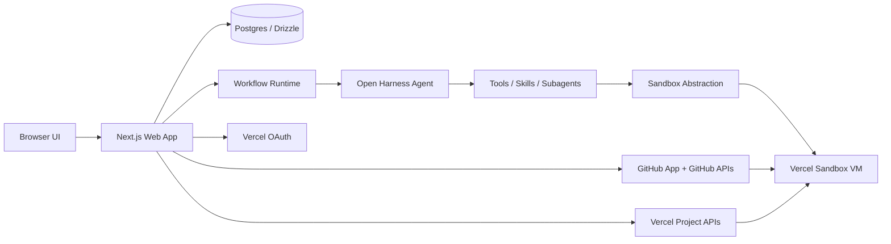
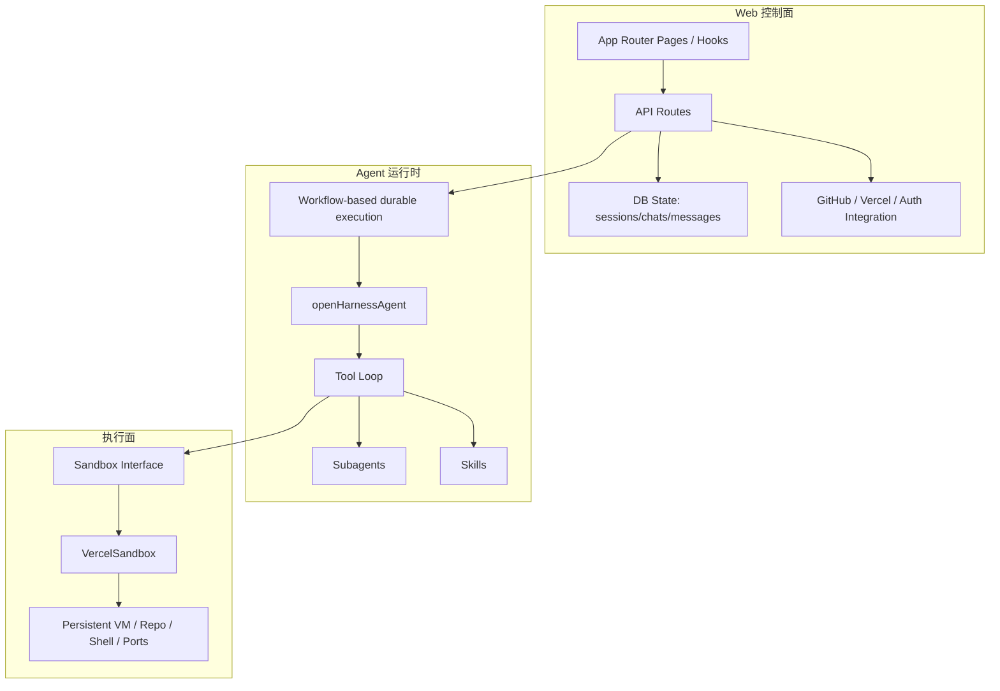
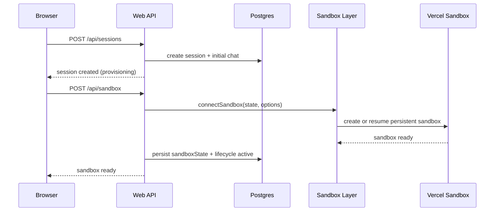
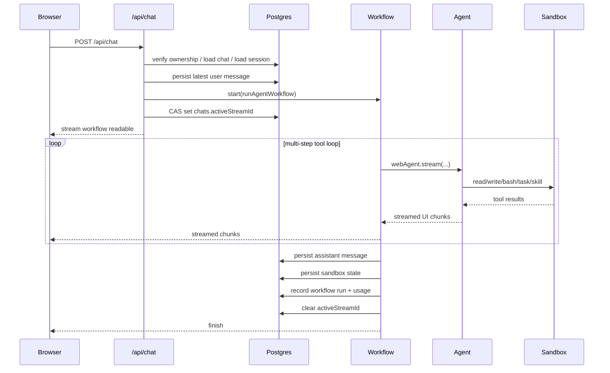
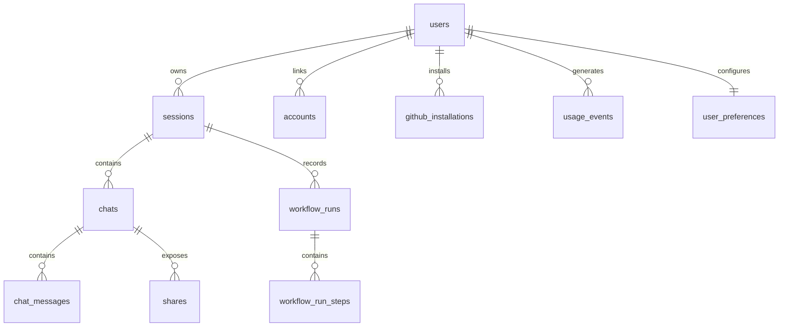

## 1. 文档目的

本文档基于当前仓库代码，对 `open-agents`（代码中也大量使用 `open-harness` 命名）进行面向实现的架构梳理。目标不是复述 README，而是回答以下问题：

- 这个项目的核心分层是什么
- 一个会话是如何被创建、初始化 sandbox、启动 agent、持续流式返回结果的
- 为什么这个系统能够支持长时间运行、断线重连、sandbox 休眠恢复和自动化 GitHub 工作流
- 当前项目的扩展点、边界和主要风险在哪里

本文档以当前代码为准，重点覆盖：

- `apps/web`
- `packages/agent`
- `packages/sandbox`
- 与之直接相关的数据库、GitHub/Vercel 集成、workflow 与流恢复机制

---

## 2. 系统总览

这个项目本质上不是“一个集成了 LLM 的 Next.js 聊天页”，而是一个三层系统：

1. `Web 控制面`
2. `Durable Agent Workflow`
3. `Cloud Sandbox 执行面`

代码仓库中的官方架构摘要也是这条主链路：

```text
Web -> Agent -> Sandbox
```

其中最关键的设计决策是：

- Agent 不直接运行在 sandbox 中
- 浏览器请求不直接承载 agent 的完整生命周期
- Web 层负责控制、持久化和恢复
- Sandbox 只是执行环境，不是控制平面

这使项目具备以下性质：

- 用户关闭页面后，后台任务仍可继续
- 浏览器连接断开后，可按 workflow run 恢复流
- sandbox 可以单独休眠、恢复、快照、超时延长
- agent 模型选择、工具系统、sandbox provider 可以独立演进

---

## 3. 仓库结构

这是一个使用 `Bun + Turborepo` 的 monorepo。

### 3.1 顶层结构

```text
apps/
  web/                 Next.js Web 控制面
packages/
  agent/               Agent runtime、工具系统、subagent、skills
  sandbox/             Sandbox 抽象层与 Vercel 实现
  shared/              共享 hooks/lib
  tsconfig/            共享 TS 配置
scripts/               运维和辅助脚本
docs/agents/           面向 agent 的仓库说明与架构摘要
```

### 3.2 关键包职责

#### `apps/web`

承担控制面职责：

- 用户认证
- session / chat / message 持久化
- 会话创建与 sandbox 初始化
- 聊天工作流启动与流式返回
- GitHub / Vercel 集成
- sandbox 生命周期编排
- 使用统计与设置管理

#### `packages/agent`

承担 agent runtime 职责：

- 模型选择与 provider 默认配置
- system prompt 拼装
- 工具注册
- subagent 委派
- skills 发现与加载

#### `packages/sandbox`

承担执行环境抽象职责：

- 定义统一的 `Sandbox` 接口
- 将状态对象转换为实际 sandbox 连接
- 目前唯一后端为 Vercel Sandbox

---

## 4. 高层架构图

### 4.1 组件架构图



### 4.2 分层关系图



---

## 5. 核心设计原则

### 5.1 控制面与执行面分离

Agent 不在 VM 中常驻运行。它通过工具接口远程操作 sandbox：

- 读写文件
- 执行 shell
- 搜索代码
- 启动 dev server
- 操作 git

这意味着 sandbox 是“可替换的执行后端”，而不是应用的核心调度器。

### 5.2 请求生命周期与任务生命周期分离

`POST /api/chat` 并不在请求内同步跑完整个 agent 流程。它只是：

- 校验权限
- 连接 sandbox
- 装配 agent 选项
- 启动 workflow
- 将 workflow 的可读流转发给前端

真正的任务生命周期由 workflow 承载，因此它可以长时间持续。

### 5.3 一切关键状态可持久化

数据库中不仅有业务数据，也有运行时控制状态：

- `sessions.sandboxState`
- `sessions.lifecycleState`
- `sessions.sandboxExpiresAt`
- `chats.activeStreamId`
- `workflow_runs`
- `workflow_run_steps`
- `usage_events`

这为断线恢复、幂等控制和后台清理提供了基础。

---

## 6. Web 控制面架构

`apps/web` 是整个系统最重的一层。它既是 UI 容器，也是系统控制平面。

### 6.1 UI 组织

从目录上看，主要页面和路由分成几类：

- `app/sessions/...`
  - 主工作区，用户在这里和 agent 交互
- `app/settings/...`
  - 模型、偏好、账号与统计设置
- `app/shared/...`
  - 分享态只读页面
- `app/api/...`
  - 控制面接口

前端核心交互围绕“session -> chat -> messages”展开。

### 6.2 API 路由分组

`app/api` 基本可分为以下几类：

#### 认证与账号

- `/api/auth/signin/vercel`
- `/api/auth/vercel/callback`
- `/api/auth/github/...`
- `/api/auth/info`
- `/api/auth/signout`

#### 聊天与 workflow

- `/api/chat`
- `/api/chat/[chatId]/stream`
- `/api/chat/[chatId]/stop`

#### session / chat / message 数据

- `/api/sessions`
- `/api/sessions/[sessionId]/...`
- `/api/sessions/[sessionId]/chats/...`

#### sandbox 生命周期

- `/api/sandbox`
- `/api/sandbox/status`
- `/api/sandbox/reconnect`
- `/api/sandbox/extend`
- `/api/sandbox/snapshot`
- `/api/sandbox/activity`

#### GitHub / Vercel / PR 相关

- `/api/github/...`
- `/api/vercel/...`
- `/api/generate-pr`
- `/api/check-pr`
- `/api/pr`

#### 配置与统计

- `/api/settings/...`
- `/api/usage`
- `/api/models`
- `/api/transcribe`

### 6.3 认证模型

当前“平台登录”以 Vercel OAuth 为核心：

1. 用户进入 `/api/auth/signin/vercel`
2. 系统生成 PKCE 参数与 state
3. 用户完成 Vercel OAuth
4. callback 交换 token，拉取用户信息
5. 用户数据写入 `users`
6. 生成加密 JWE session cookie

GitHub 更像是“附加能力连接”而不是主登录源，主要用于：

- 获取 repo 访问权限
- 安装 GitHub App
- 创建分支、push、PR
- 接收 webhook 同步 PR / installation 状态

### 6.4 Session 创建

会话创建分两步理解：

#### 第一步：创建 session 记录

`POST /api/sessions` 负责：

- 校验用户
- 应用 managed template trial 限制
- 校验 repo owner/name
- 解析用户偏好
- 计算默认标题、默认模型、auto-commit 选项
- 创建 `session + initialChat`

这一步结束后：

- `session.status = running`
- `session.sandboxState = { type: "vercel" }`
- `session.lifecycleState = provisioning`

也就是说，session 创建并不等于 sandbox 已准备完成。

#### 第二步：初始化 sandbox

`POST /api/sandbox` 负责真正创建或恢复 Vercel sandbox，并将最新状态回写到 `sessions.sandboxState`。

---

## 7. Durable Workflow 架构

这是项目能够支持长任务和断线恢复的关键。

### 7.1 为什么要用 workflow

如果 agent 直接跑在 API 请求内，会遇到典型问题：

- 请求超时
- 页面刷新导致任务丢失
- 网络闪断导致流中断
- 长时间工具调用无法稳定承载

这个项目的解决方案是：

- `POST /api/chat` 只做启动和接线
- 真实执行逻辑放进 `runAgentWorkflow`

### 7.2 聊天 workflow 主循环

`runAgentWorkflow` 的职责：

1. 将 UI messages 转成 model messages
2. 生成 assistant message id
3. 打开 workflow writable stream
4. 循环执行 agent step
5. 将每步输出流式写回前端
6. 在合适的时候停止，或者继续下一步
7. 持久化消息、sandbox state、usage、workflow run
8. 在自然完成后可选执行 auto-commit / auto-PR

### 7.3 step 继续条件

一个 step 完成后，如果 `finishReason === "tool-calls"`，且工具并未停在“需要用户确认/输入”的状态，则 workflow 会继续推进下一步。

这使得系统支持：

- 多步工具链
- 自动 tool loop
- 中途暂停等待用户输入

### 7.4 workflow 运行记录

数据库中有两类执行记录：

- `workflow_runs`
- `workflow_run_steps`

其作用包括：

- UI 或后台分析执行时长
- 记录 step 级 finish reason
- 回溯异常执行
- 后续做可观测性扩展

---

## 8. Agent Runtime 架构

### 8.1 主 agent 形态

`packages/agent/open-harness-agent.ts` 中定义了主 agent：

- 类型：`ToolLoopAgent`
- 默认模型：`anthropic/claude-opus-4.6`
- 通过 `prepareCall()` 动态注入运行上下文

注入的上下文包括：

- sandbox state
- working directory
- current branch
- environment details
- 技能列表
- 主模型和 subagent 模型选择
- 自定义附加 instructions

### 8.2 工具系统

主 agent 暴露的核心工具如下：

- `todo_write`
- `read`
- `write`
- `edit`
- `grep`
- `glob`
- `bash`
- `task`
- `ask_user_question`
- `skill`
- `web_fetch`

可以把它理解为一个“统一的 agent OS API”。

### 8.3 模型网关

模型统一经由 AI SDK gateway 访问。`packages/agent/models.ts` 做了两件关键事：

1. 把 provider 差异抽象到统一的 `gateway(modelId)`
2. 对不同 provider 应用默认策略

例如：

- Anthropic 4.6 默认 adaptive thinking
- OpenAI GPT-5 默认 `store: false`
- GPT-5 开 reasoning/encrypted content 支持

这意味着：

- 上层逻辑不需要知道 provider 细节
- 模型切换主要体现在配置层

### 8.4 Subagent 体系

`task` 工具不是普通外部工具，而是“启动另一个 agent”：

- `explorer`
  - 只读探索、追踪代码、回答问题
- `executor`
  - 有文件修改能力，适合实现工作
- `design`
  - 专注高质量前端/UI 设计实现

Subagent 机制的价值在于：

- 让主 agent 保持较短上下文
- 将复杂任务拆给专门子角色
- 提升多步工作时的结构清晰度

### 8.5 Skills 体系

skills 不是硬编码的 prompt 片段，而是运行时从 sandbox 文件系统中发现的：

1. 扫描 skill 目录
2. 查找 `SKILL.md`
3. 解析 frontmatter
4. 注入到 agent system prompt / tool 体系中

这意味着 skill 是一种“文件系统插件”：

- repo 内可以自带项目级 skill
- 用户还可以安装全局 skill
- Web 在创建 sandbox 后会按 session 安装 global skills

---

## 9. Sandbox 架构

### 9.1 抽象接口

`packages/sandbox/interface.ts` 中定义了统一的 `Sandbox` 接口，主要能力包括：

- 文件读写
- 目录遍历
- `exec`
- `execDetached`
- 端口映射 `domain(port)`
- `stop()`
- `extendTimeout()`
- `snapshot()`
- `getState()`

这使 agent 工具不需要关心底层具体是 Vercel、Docker 还是别的执行后端。

### 9.2 当前唯一实现：Vercel Sandbox

当前 `connectSandbox()` 最终会走 `connectVercel()`。

`VercelState` 支持几种状态来源：

- `sandboxName`
  - 连接/恢复持久 sandbox
- `source`
  - 从 repo 创建新 sandbox
- `snapshotId`
  - 从快照恢复

### 9.3 Persistent Sandbox 模型

每个 session 通常会绑定一个命名的持久 sandbox：

- session 创建后可初始化 sandbox
- 之后再次打开会话时，Web 侧通过 `sandboxState` 重新连接
- sandbox 超时或休眠后，session 中保留状态用于恢复/清理

### 9.4 GitHub 凭据代理

一个重要安全设计是：

- GitHub token 不直接“裸注入”为 sandbox 内环境变量
- 而是通过 Vercel Sandbox 的 network policy 做 credential brokering

这样做的好处是：

- sandbox 可以访问 GitHub clone/push
- 但 token 暴露面更小
- 控制逻辑依然留在 Web/控制面

### 9.5 Sandbox 初始化时做的额外动作

创建或恢复 sandbox 后，Web 还会做几件控制面动作：

- 同步 Vercel CLI 登录态到 sandbox
- 安装 session 绑定的 global skills
- 更新 `sessions.sandboxState`
- 启动 sandbox 生命周期 workflow

---

## 10. 端到端运行时序

### 10.1 会话创建与 sandbox 初始化



### 10.2 一次聊天请求时序



---

## 11. 数据架构

### 11.1 为什么数据库是“控制数据库”

这套数据库不仅存业务对象，还存运行控制状态。

### 11.2 核心表

#### `users`

平台登录用户。当前主登录来源是 Vercel。

#### `accounts`

外部账号连接。目前最关键的是 GitHub 用户账号及其 token。

#### `github_installations`

GitHub App installation 记录，用于 repo 访问授权与安装同步。

#### `vercel_project_links`

repo 与 Vercel project 的用户级关联。

#### `sessions`

最重要的聚合根。它同时承载：

- repo 上下文
- 分支信息
- Vercel project 关联
- auto-commit / auto-PR session override
- global skill refs
- `sandboxState`
- lifecycle 状态
- diff / snapshot / PR 元数据

#### `chats`

session 下的对话线程。关键控制字段：

- `modelId`
- `activeStreamId`
- `lastAssistantMessageAt`

#### `chat_messages`

以 JSON 方式存储完整消息 parts，兼容 text、reasoning、tool parts、data parts。

#### `workflow_runs` / `workflow_run_steps`

workflow 运行与 step 记录。

#### `user_preferences`

用户默认模型、subagent 模型、global skills、启用模型、auto-commit 等偏好。

#### `usage_events`

记录 token 使用量与工具调用次数。

### 11.3 数据模型关系图



---

## 12. 流式传输与稳定性设计

这是当前项目最有工程含量的部分之一。

### 12.1 问题背景

链路实际上很长：

```text
LLM Provider -> AI SDK / Gateway -> Workflow Runtime -> Next.js Route -> Browser
```

如果寄希望于“一条长连接永远不断”，系统会非常脆弱。因此当前实现选择的是：

- 任务与连接分离
- 流断开可恢复
- 关键状态入库
- 客户端主动探测恢复

### 12.2 `activeStreamId` 作为恢复锚点

`chats.activeStreamId` 是聊天流恢复的核心锚点：

- workflow 启动后，原子写入 runId
- 浏览器刷新后，通过这个 id 找回当前 workflow
- workflow 完成或失败后，清理该字段

并发控制依赖 compare-and-set：

- 只有当前值匹配预期时才更新
- 避免重复请求启动多个 workflow
- 避免旧 workflow 清掉新 workflow 的状态

### 12.3 `/api/chat/[chatId]/stream`

这个接口的作用不是启动任务，而是：

- 读取 chat 的 `activeStreamId`
- 用 `getRun(runId)` 连接到已有 workflow
- 将其 `ReadableStream` 重新暴露给前端
- 如果 run 已结束或不存在，则清理陈旧状态

### 12.4 前端恢复机制

前端使用 `AbortableChatTransport`，目的是修补 AI SDK 在 reconnect 场景下的 abort 问题：

- 普通 fetch 可取消
- reconnect fetch 也可取消
- route unmount 时不泄露连接

同时前端还实现了自动恢复策略：

- 页面重新 visible
- window focus
- 浏览器恢复 online
- 长时间没有收到首段输出

此时客户端会：

1. 先 probe 当前 chat 是否仍在 streaming
2. 如果服务端还在跑，则走 `resumeStream()`
3. 如果用户明确点过 stop，则不自动重连

### 12.5 `ReadableStream` 取消修补

workflow runtime 返回的 stream 默认取消处理不够稳，因此项目在 Web 层包了一层 `createCancelableReadableStream()`，专门处理：

- client disconnect
- abort race
- run not found
- late 404 / aborted 响应

### 12.6 设计结果

系统保障的不是“连接永不断”，而是：

- 浏览器断开，workflow 还在
- 页面刷新后可恢复现有流
- stale stream id 会被清理
- 本地 transport 可安全 abort / retry

仍然不能完全保证的部分是：

- provider 到 workflow 之间单 step 中途失败
- 用户已经看到但尚未被 server side 持久化的部分 token

换句话说，当前系统对“连接中断”已经有强恢复能力，但对“provider 侧 step 中断”的恢复仍然以重试和重新发起为主。

---

## 13. Sandbox 生命周期管理

### 13.1 生命周期状态

`sessions.lifecycleState` 目前包括：

- `provisioning`
- `active`
- `hibernating`
- `hibernated`
- `restoring`
- `archived`
- `failed`

### 13.2 为什么单独做 lifecycle workflow

如果只在用户请求时顺便清理 sandbox，会出现：

- 用户离线后无人触发回收
- sandbox 超时或长期空闲无法主动处理
- DB 状态和真实 VM 状态逐渐漂移

因此项目单独引入了 `sandboxLifecycleWorkflow`：

- 定期唤醒
- 查看是否到达 inactivity / expiry 时间点
- 如果 session 仍在跑 workflow，则跳过
- 否则停止 sandbox，并更新会话为 hibernated

### 13.3 生命周期驱动信号

生命周期的“due time”由两类时间共同决定：

- inactivity timeout
- sandbox 过期时间减去 buffer

取较早者触发休眠判断。

### 13.4 lifecycle lease

为避免多个后台任务同时处理同一个 session，项目使用：

- `sessions.lifecycleRunId`

它相当于一个 lease：

- 先 claim
- claim 成功者才启动 lifecycle workflow
- stale lease 可被识别和回收

### 13.5 reconnect / status 路由的作用

`/api/sandbox/status` 和 `/api/sandbox/reconnect` 是控制面与真实 sandbox 状态对齐的安全阀：

- 检查 runtime state 是否还有效
- 发现 lifecycle failed 但 runtime 仍在时，修正状态
- 发现 sandbox 已不可用时，将 session 转为 hibernated / expired

---

## 14. GitHub / Vercel 集成架构

### 14.1 GitHub 集成分成两层

#### GitHub 用户 token

用途：

- 用户级 API 调用
- repo clone / push
- 安装同步

特点：

- 存储加密
- 支持 refresh token 刷新
- 每次按需解密取出

#### GitHub App installation

用途：

- 对 repo / org 做正式安装授权
- 创建 PR
- 接收 webhook

GitHub webhook 还会回写系统状态：

- installation 变化同步 `github_installations`
- PR closed / merged 会更新 session 的 `prStatus`
- 部分场景下触发 session 归档

### 14.2 Vercel 集成

Vercel 集成也分两层：

#### Vercel OAuth 登录

这是平台身份认证层。

#### Vercel Project 关联

这是 repo -> deployable project 的映射层，主要用于：

- 找到 repo 对应的 Vercel project
- 同步 dev env 配置的潜在能力
- 在 sandbox 中同步 Vercel CLI 登录态

### 14.3 自动 Commit / PR

聊天 workflow 自然结束后，若 session 或用户偏好允许：

1. 检查 sandbox 内是否存在可提交更改
2. 执行 auto-commit
3. 如满足条件，再执行 auto-create-PR
4. 将结果以 data parts 追加到 assistant message 中

所以 commit / PR 不是独立后台任务，而是聊天 workflow 的 post-finish 阶段。

---

## 15. 分享、只读视图与多聊天模型

### 15.1 session 与 chat 的关系

设计上：

- 一个 session 对应一个代码工作区与 sandbox
- 一个 session 下可有多个 chat

这意味着多个对话线程可以复用同一工作区上下文。

### 15.2 fork through message

系统支持基于已有 assistant message 分叉 chat：

- 新 chat 复制原 chat 到某条 assistant message 为止的历史
- 新 chat 不继承 `activeStreamId`
- 共享原 session 的 sandbox 与 repo 上下文

这是“分支式对话”而非“新建执行环境”。

### 15.3 分享能力

`shares` 表与 `/app/shared/[shareId]` 页面提供只读分享视图：

- 共享的是 chat 视图
- 不是新的执行 session
- 分享页会感知 `activeStreamId` 判断是否正在 streaming

---

## 16. 构建与部署模型

### 16.1 Monorepo 构建

根脚本负责：

- `bun run web`
- `turbo build`
- `turbo typecheck`
- `bun run ci`

### 16.2 数据库迁移策略

`apps/web` 的 `build` 脚本会在 `next build` 前执行：

```text
bun run db:migrate:apply && next build
```

这意味着部署时会自动应用待执行迁移。

### 16.3 当前运行依赖

从代码路径看，当前真正的硬依赖包括：

- Postgres
- JWE secret / encryption key
- Vercel OAuth

若要启用完整的 repo 操作与 PR 工作流，还需要：

- GitHub App 配置
- GitHub webhook secret

---

## 17. 扩展点

### 17.1 新增 sandbox provider

理论上可以通过 `packages/sandbox` 增加新的 provider：

- 只要实现 `Sandbox` 接口
- 再扩展 `SandboxState` 与 `connectSandbox()`

但当前 Web 控制面有较多地方默认假定 provider 为 `vercel`，因此真实接入仍需要改动：

- session schema
- sandbox lifecycle
- reconnect/status 路由
- UI 状态文案

### 17.2 新增工具

在 `packages/agent/tools` 添加工具后：

- 在主 agent 注册
- 如涉及 UI state，需要扩展 message part 渲染
- 如涉及使用量统计，需要考虑 task usage 聚合

### 17.3 新增 skill 来源

当前 skill 是文件系统驱动，未来可扩展为：

- 远端 skill registry
- per-org skill source
- skill 签名与版本管理

### 17.4 新增前端工作区能力

由于 session 与 sandbox 已经稳定绑定，理论上可以在现有 chat UI 之上继续叠加：

- 文件树编辑
- diff review
- 终端视图
- 预览端口管理

这些都属于控制面新功能，而不需要重写 agent runtime。

---

## 18. 当前架构优势

### 18.1 优势

- 控制面、推理面、执行面边界清晰
- 天然适合长任务和断线重连
- sandbox 生命周期可独立管理
- agent 工具与 skill 体系可扩展
- session/chat/message 数据模型能支撑复杂 UI
- GitHub / Vercel 集成不是硬编码在 agent 内，而是控制面能力

### 18.2 代价

- `apps/web` 负担很重，既是 UI 又是 orchestration layer
- session 表承载信息较多，聚合根很强但也容易膨胀
- 对 Vercel sandbox provider 的耦合仍然较深
- LLM step 级中断恢复还没有做到事务化
- 技能、subagent、工具、workflow 交叉后，调试复杂度较高

---

## 19. 架构风险与后续建议

### 19.1 当前主要风险

- `apps/web` 控制面逻辑较集中，继续扩展后可能需要更明确的 service layer
- provider 侧 step 中途失败时，部分流式可见内容可能还未持久化
- sandbox lifecycle 与 reconnect 逻辑已经较复杂，需要持续用测试保护
- 多种状态来源同时存在时，DB state 与真实 sandbox state 仍可能产生短暂漂移

### 19.2 建议的演进方向

- 把 `apps/web` 中的 orchestration 进一步模块化为 session/chat/sandbox/github service
- 为 provider step 失败引入更细粒度的中间态持久化
- 为 sandbox provider 抽象增加更明确的 capability model
- 为 workflow / reconnect / lifecycle 增加更统一的可观测性事件流

---

## 20. 总结

Open Agents 当前的核心不是“聊天 UI”，而是一个围绕 coding agent 构建的完整执行系统：

- `Web` 是控制面，负责认证、持久化、调度、恢复与集成
- `Workflow + Agent` 是推理与工具编排层，负责多步决策与任务推进
- `Sandbox` 是执行面，负责真实文件系统、shell、git 与预览端口

项目最重要的工程价值在于，它把“长时间运行的 coding task”从一次 HTTP 请求中解耦出来，并通过：

- workflow 持久化
- `activeStreamId` 流恢复
- sandbox lifecycle
- DB 控制状态

把一个容易中断的链路，改造成了“连接可断、任务可续、状态可对齐”的系统。

如果把当前项目用一句话概括：

> 它是一个以 Next.js 为控制面、以 Workflow 为执行编排器、以 Vercel Sandbox 为执行后端的可恢复型 coding agent 平台。
