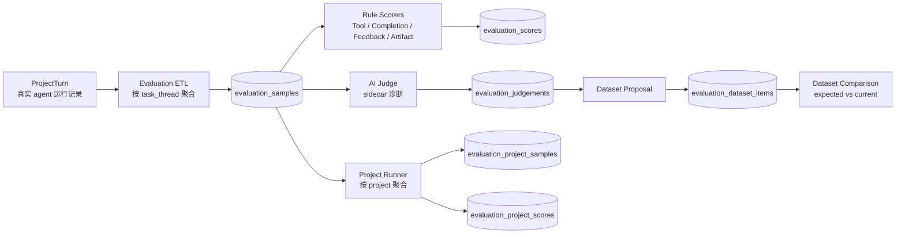
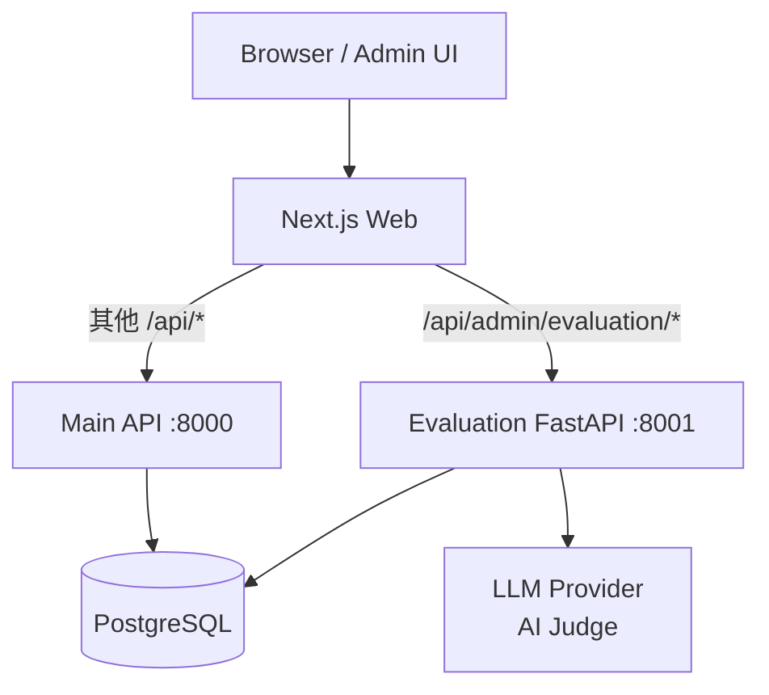
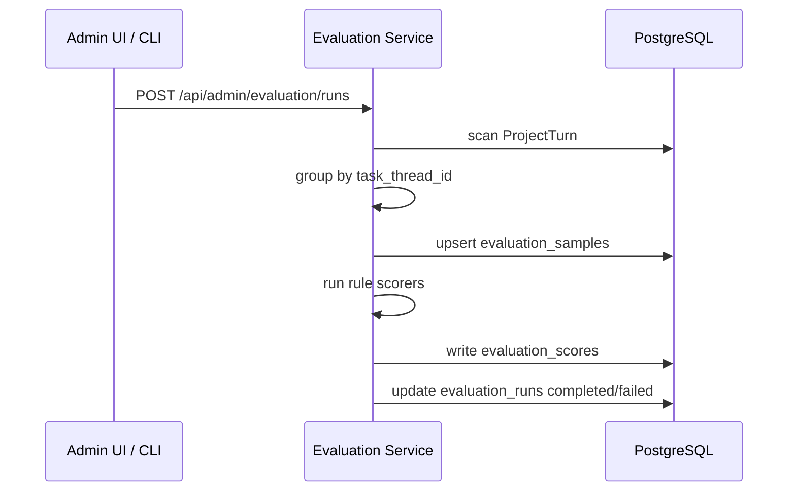
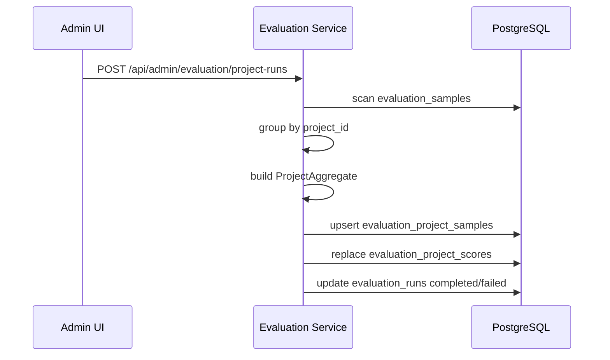

# Tipsy Studio Agent Evaluation Architecture

## 1. 目标

Agent Evaluation 的目标是把真实用户项目里的 agent 运行沉淀成可查询、可评分、可回归对比的评估数据。

当前评估分两层：

- **Task-level evaluation**：评估一次用户任务是否完成得好。它会把中断、continue、重试等多轮 attempt 聚合成一个 task sample。
- **Project-level evaluation**：评估一个项目在一段时间内是否整体完成得好。它会把同一个项目里的多个 task samples 聚合成一个 project sample。

AI Judge 只作为辅助诊断和 dataset 候选来源，不直接覆盖规则评分。Dataset 保存人工确认后的 golden expectation，用于后续回归检查。

## 2. 总体架构



## 3. 服务部署架构

Evaluation 是独立服务，不再依赖主 API 挂载 evaluation routes。



本地 compose：

- `api`: 主 API。
- `evaluation`: 独立 evaluation FastAPI，监听容器内 `8001`。
- `web`: admin evaluation 页面，通过 Next.js proxy 访问 evaluation。

Coolify preview：

- `web`: `https://315-studio...`
- `api`: `https://315-api-studio...`
- `evaluation`: `https://315-evaluation-studio...`

web proxy 对 `/api/admin/evaluation/*` 会优先走 evaluation 服务。preview 环境中可以从 `315-studio...` 推断 `315-evaluation-studio...`；普通 compose fallback 是 `http://evaluation:8001`。

## 4. 模块划分

```text
apps/evaluation/
├── server.py          # 独立 FastAPI app，只跑 Base.metadata.create_all
├── routes.py          # admin evaluation HTTP API
├── runner.py          # task-level ETL + rule scoring + rescore
├── project_runner.py  # project-level 聚合评分
├── etl.py             # ProjectTurn -> EvaluationSample
├── scorers/           # task-level rule scorers
├── ai_judge.py        # AI Judge sidecar
├── datasets.py        # dataset proposal / comparison / repair
└── cli.py             # 离线批处理 CLI
```

新表定义都在 `apps/api/models.py`。新增表通过 `Base.metadata.create_all` 创建，不放到 `startup_migrations.py`。`startup_migrations.py` 只用于已有表的补丁迁移。

## 5. 数据表

### Task-Level 表

| 表 | 作用 | 核心字段 |
|---|---|---|
| `evaluation_runs` | 一次评估运行记录 | `status`, `window_from`, `window_to`, `sample_count`, `score_count`, `scorer_versions`, `stats`, `error_message` |
| `evaluation_samples` | task-level 样本，一次用户任务 | `turn_id`, `project_id`, `evaluation_run_id`, `chat_run_id`, `root_chat_run_id`, `task_thread_id`, `attempt_count`, `continuation_chain`, `user_intent_redacted`, `tool_call_trace`, `final_status`, `overall_verdict`, `failure_mode` |
| `evaluation_scores` | task-level 规则评分明细 | `sample_id`, `dimension`, `scorer`, `score`, `verdict`, `weight`, `details` |
| `evaluation_judgements` | AI Judge 输出 | `sample_id`, `turn_id`, `judge_version`, `judge_model_id`, `overall_quality_score`, `overall_verdict`, `failure_label_assessment`, `rationale`, `raw_response` |

Task-level sample 的关键点：它不是单个 turn，而是按 `task_thread_id` 聚合后的用户任务。continue / retry 产生的多次 attempt 会合并到同一个 `evaluation_samples` 中。

### Project-Level 表

| 表 | 作用 | 核心字段 |
|---|---|---|
| `evaluation_project_samples` | project-level 样本，一个项目窗口内多个 task samples 的聚合结果 | `evaluation_run_id`, `project_id`, `window_from`, `window_to`, `task_sample_ids`, `task_count`, `pass_count`, `warn_count`, `fail_count`, `pending_count`, `final_status`, `overall_verdict`, `failure_summary`, `first_user_intent_redacted`, `last_user_intent_redacted`, `duration_ms`, `tool_call_count`, `model_name`, `agent_version`, `final_version_id` |
| `evaluation_project_scores` | project-level 评分明细 | `project_sample_id`, `dimension`, `scorer`, `score`, `verdict`, `weight`, `details` |

Project-level 维度：

| dimension | 含义 |
|---|---|
| `final_outcome` | 最终 task 是否成功完成 |
| `requirement_coverage` | 项目内 task verdict 是否显示需求覆盖风险 |
| `iteration_efficiency` | task 数、attempt 数、tool call 数是否过高 |
| `stability` | 最终状态和中间失败情况 |
| `correction_burden` | 是否出现重复 failure mode 或多次失败 |

Project runner 会先构造 `ProjectAggregate`，统一完成排序、verdict counts、failure summary、tool/attempt 汇总，然后供 project scorer 和 project sample 写入共同复用，避免重复计算。

### Dataset 表

| 表 | 作用 | 核心字段 |
|---|---|---|
| `evaluation_datasets` | golden dataset 集合 | `name`, `description`, `status`, `created_by`, `frozen_at` |
| `evaluation_dataset_items` | dataset 中的期望值 | `dataset_id`, `sample_id`, `turn_id`, `expected_overall_verdict`, `expected_failure_mode`, `expected_dimensions`, `source`, `review_status`, `confidence`, `notes` |

Dataset item 只保存 expected/golden fact，不保存 current result 或 match result。current/match 是 `/comparisons` 动态计算出来的派生视图。

## 6. 评分与数据流

### Task-Level 流程



Task-level 评分维度：

- `tool_compliance`
- `completion`
- `user_feedback`
- `artifact_quality`

其中 performance/duration 目前是 diagnostic signal，不直接影响 overall verdict。

### Project-Level 流程



Project-level 失败处理：`run_project_batch` 如果中途失败，会先 rollback 主 session，然后用独立 `AsyncSessionLocal()` 把对应 `evaluation_runs.status` 标记为 `failed`，避免请求 session 已经异常时 run 记录卡住。

## 7. API

Evaluation 服务挂载在 `/api` 下。

主要 endpoint：

| Endpoint | 作用 |
|---|---|
| `GET /api/health` | health check |
| `GET /api/admin/evaluation/summary` | 评估汇总 |
| `POST /api/admin/evaluation/runs` | 跑 task-level rule evaluation |
| `POST /api/admin/evaluation/runs/preview` | 预览 task-level run 影响范围 |
| `GET /api/admin/evaluation/samples` | task samples 列表 |
| `GET /api/admin/evaluation/samples/{sample_id}` | task sample 详情 |
| `POST /api/admin/evaluation/project-runs` | 跑 project-level evaluation |
| `POST /api/admin/evaluation/project-runs/preview` | 预览 project-level run 影响范围 |
| `GET /api/admin/evaluation/project-samples` | project samples 列表 |
| `GET /api/admin/evaluation/project-samples/{project_sample_id}` | project sample 详情 |
| `POST /api/admin/evaluation/judgements` | 跑 AI Judge |
| `POST /api/admin/evaluation/judgements/preview` | 预览 AI Judge 影响范围 |
| `GET /api/admin/evaluation/datasets` | dataset 列表 |
| `POST /api/admin/evaluation/datasets` | 创建 dataset |
| `GET /api/admin/evaluation/datasets/{dataset_id}/items` | dataset items |
| `GET /api/admin/evaluation/datasets/{dataset_id}/comparisons` | expected vs current comparison |
| `POST /api/admin/evaluation/datasets/{dataset_id}/proposals` | 从 AI Judge 结果提 dataset candidate |
| `GET /api/admin/evaluation/versions` | agent/model/scorer version 视图 |
| `GET /api/admin/evaluation/compare` | 两个版本窗口对比 |

## 8. Admin UI

前端页面位于：

```text
apps/web/app/admin/evaluation/
```

主要能力：

- 查看 summary、verdict 分布、dimension 分布。
- 运行 task-level evaluation。
- 运行 project-level evaluation。
- 运行 AI Judge。
- 查看 task samples 列表和详情。
- 查看 project samples 列表和详情。
- 查看 dataset items 和 comparisons。
- 管理 dataset item。

## 9. 部署与环境变量

### 必要变量

| 变量 | 用途 |
|---|---|
| `DATABASE_URL` | evaluation 读写同一 PostgreSQL |
| `REDIS_URL` | compose/service 运行依赖 |
| `LLM_API_KEY` | AI Judge / LLM 调用 |
| `LLM_BASE_URL` | AI Judge / LLM 调用 |
| `CHAT_JWT_PUBLIC_KEY_PEM` | admin API 鉴权 |
| `CHAT_JWT_AUDIENCE` | JWT audience |
| `CHAT_JWT_ISSUER` | JWT issuer |
| `AUTH_ENABLED` | 是否启用鉴权，线上通常为 `true` |
| `ADMIN_USER_IDS` | 允许访问 admin evaluation 的用户 id |
| `WEB_ORIGIN_ALLOWLIST` | CORS allowlist |
| `BACKEND_API_BASE` | CORS origin 推导和服务 base 配置 |

### Evaluation Proxy 变量

| 变量 | 用途 |
|---|---|
| `EVALUATION_API_PROXY_TARGET` | 手动指定 web proxy 的 evaluation target；默认 compose 为 `http://evaluation:8001` |
| `NEXT_API_PROXY_INFER_PREVIEW_TARGET` | Coolify preview 中开启 host 推断，默认 true |

Coolify 主环境需要给 evaluation service 配一次 domain，例如：

```text
https://evaluation-studio.infra.fantacy.live:8001
```

PR preview 会自动派生：

```text
https://315-evaluation-studio.infra.fantacy.live:8001
```

## 10. 当前限制

- task-level 和 project-level 规则仍偏启发式，需要继续用真实 case 校准。
- project runner 当前 `limit` 是 sample limit，不是 project limit。
- Dataset golden 需要人工 review，不能完全依赖 AI Judge 自动生成。
- 完整 replay 还需要 workspace base version、外部资产、agent/tool/model version 的更强约束。
- evaluation 目前仍复用 `apps/api` 的 model/config/runtime，未来如果拆独立仓库，需要先稳定 shared schema 和 shared config contract。
