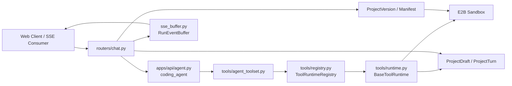
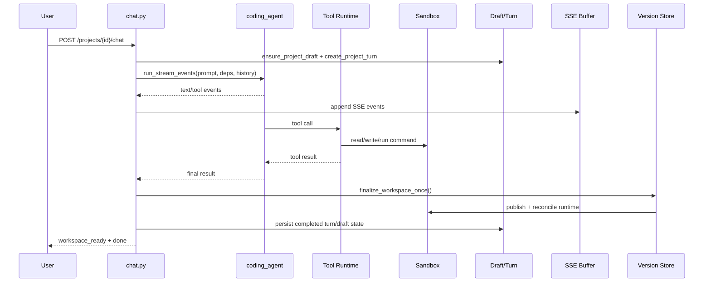
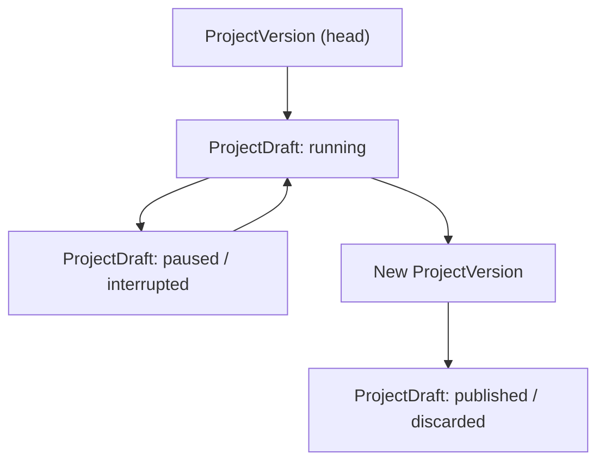

## 1. 文档定位

本文描述 Tipsy Studio 当前项目内“编码 Agent”的实现级架构，主线对应后端接口 `POST /api/projects/{project_id}/chat`。

它回答的是下面这些问题：

- 编码 Agent 在控制面中的职责边界是什么。
- 一次 chat run 如何完成模型编排、工具执行、SSE 推流、workspace draft 持久化和最终发布。
- pause / resume / 用户问答中断 / 资源 proposal 中断是如何实现的。
- 为什么当前实现采用“运行期先改 sandbox，成功后统一发布 version”的模型。

本文不是仓库总架构文档的替代品：

- 平台级 Brain-Hand 分层、Cloudflare、Sandbox 生命周期等总体设计，见仓库根目录 `architecture.md`。
- `/api/sdk/*` 相关的无状态 completion、角色聊天、operator resolve 结构，见 `sdk-architecture.md`。

本文只在最后用一个小节说明编码 Agent 与 SDK LLM 链路的边界。

---

## 2. Agent 在整体系统中的位置

Tipsy Studio 的控制面是一个 FastAPI 服务，真正的“编码 Agent”是其中一条有状态编排链路：

- 上游输入：项目 ID、用户消息、当前活跃 Session、可选 continuation 信息。
- 编排中心：`apps/api/routers/chat.py` + `apps/api/agent.py`。
- 工具执行面：`apps/api/tools/*`，经 runtime registry 装配后由 Agent 调用。
- 执行环境：E2B sandbox，通过 `apps/api/services/sandbox_gateway.py` 访问。
- 工作区状态：`apps/api/services/workspace_versions.py`、`workspace_materializer.py`、`workspace_store.py`。
- 持久化：`ProjectDraft`、`ProjectTurn`、`ProjectVersion`。
- 流式输出：`apps/api/services/sse_buffer.py` 维护可恢复的 SSE 事件缓冲。

核心思路不是“让模型直接改正式版本”，而是：

1. Agent run 期间在 sandbox 中执行工具，并把副作用累积进 `WorkspaceRunState`。
2. run 成功结束后统一校验、发布 manifest/version，并把 sandbox 运行时重对齐到发布后的状态。
3. 如果 run 中断，则保留 draft 和 partial response，后续可继续。

这使得编码 Agent 同时具备三种能力：

- 运行中操作 sandbox，实时获得真实代码上下文。
- 运行失败时不污染正式版本。
- 运行暂停后可以基于 draft 恢复。

---

## 3. 核心运行时对象

### 3.1 `coding_agent`

编码 Agent 定义在 `apps/api/agent.py`，核心对象是 `coding_agent = Agent(...)`。

它的职责很纯粹：作为 pydantic-ai 的容器，统一管理以下内容：

- 系统提示词 `SYSTEM_PROMPT`
- 依赖类型 `AgentDeps`
- `history_processors=[prepare_message_history]`
- 重试与兼容能力
- 已注册工具

其中 `SYSTEM_PROMPT` 不是单块静态字符串，而是由多个 section 拼出来的：

- 身份与环境说明
- 创意/实现策略
- workflow 与 tool routing 规则
- chat 相关强约束
- project resources 的使用顺序约束
- skills 索引

这意味着模型行为不是单纯靠路由层控制，很多“必须先读文件”“必须先 run skill”“资源修改要先 proposal”之类的工程约束，已经沉淀在 Agent prompt 中。

### 3.2 `AgentDeps`

`AgentDeps` 是一次 run 期间的依赖注入对象，字段包括：

- `sandbox`: 当前 E2B sandbox 连接
- `session_id`: 当前项目活跃 session
- `project_id`: 当前项目
- `run_id`: 本次 chat run 的全局 ID
- `base_version_id`: 本次 run 起始时所基于的 workspace version
- `workspace_run_state`: 本次 run 的工作区副作用累积状态
- `task_plan_state`: 本次 run 的任务计划状态
- `file_read_state`: 读文件新鲜度跟踪，用于防止盲改

关键点是：`AgentDeps` 不是数据库模型，也不是 HTTP schema，它只服务于“一次模型运行的局部执行上下文”。

### 3.3 `WorkspaceRunState`

`WorkspaceRunState` 定义在 `apps/api/services/workspace_versions.py`，它是整个编码 Agent 架构里最关键的状态容器之一。

它不代表正式版本，只代表“这次 run 已经做过、但还没发布”的累计副作用，主要包括：

- `run_id`
- `base_version_id`
- `draft_id`
- `turn_id`
- `draft_manifest_key`
- `requested_package_installs`
- `requested_restart_dev_server`
- `changed_files`
- `deleted_paths`
- `pending_contents`

设计意义：

- 文件工具不直接创建正式 `ProjectVersion`。
- 安装依赖、重启 dev server 这类运行时操作也先记在 run state 里。
- 只有在 run 结束并完成校验时，才由统一收敛逻辑把这些状态转成发布结果。

### 3.4 `TaskPlanState`

`TaskPlanState` 定义在 `apps/api/services/task_plans.py`，只维护 run 内任务计划：

- `pending`
- `in_progress`
- `completed`
- `failed`
- `interrupted`

它的边界非常清晰：

- 不是长期业务实体
- 不单独落库成表
- 主要通过 assistant payload / continuation context 持久化与恢复

也就是说，task plan 更像“给 Agent 和前端看的过程状态”，不是平台资源。

---

## 4. 运行时组件图



---

## 5. 一次 chat run 的主链路

### 5.1 请求入口与前置校验

编码 Agent 的入口是 `apps/api/routers/chat.py` 中的 `agent_chat(...)`。

请求到达后，路由先做四类前置工作：

1. 生成本次 `chat_run_id`
2. 解析并确定模型选择
3. 校验 project、active session、sandbox 是否可用
4. 判断本次是否是 continuation

这里的模型选择不是在 Agent 对象里固定写死的，而是运行时通过 LLM registry 解析出来，再传给 `coding_agent.override(...)`。

因此：

- `coding_agent` 是一个通用编排容器。
- 真正使用哪个 provider/model，是由每次请求的 selection 决定。

### 5.2 draft 与 continuation 决策

路由会读取当前项目的 active draft 和最近一次 draft turn，用来决定：

- 是否允许 continuation
- continuation 是否还和最新 draft 匹配
- 是否需要恢复之前未发布的工作区状态

这里的关键判断对象是：

- `ProjectDraft`
- `ProjectTurn`
- 最新 draft 上记录的 `run_id`

如果 continuation 有保存过 workspace state，则路由会：

1. 读取 draft manifest
2. 停掉当前 sandbox runtime
3. 把 draft manifest materialize 回 `/home/user`
4. 调用 `reconcile_sandbox_runtime(...)` 恢复运行时

这一步保证 continuation 不是只恢复“对话上下文”，而是恢复到“代码和对话一致”的执行现场。

### 5.3 初始化 turn 与 run state

完成前置判断后，路由会：

- `ensure_project_draft(...)`
- 创建本次 `ProjectTurn`
- 构造 `AgentDeps`
- 初始化 `WorkspaceRunState`

这意味着从这一刻开始，模型的所有工具副作用都能挂到同一个 run / turn / draft 上。

### 5.4 启动 Agent 流式执行

真正运行模型的逻辑在 `stream_with_agent_run()` 内部，通过：

```python
async for event in coding_agent.run_stream_events(...):
```

执行时还做了两件很重要的事：

- `coding_agent.override(...)` 注入本次实际模型和模型配置
- `coding_agent.parallel_tool_call_execution_mode("parallel")` 允许并行 tool call

这里的 run 不是简单地产出文本，而是持续产出 event：

- 文本增量
- tool call
- tool result
- status
- error

路由把这些 event 统一转换成 SSE payload，并写入 `RunEventBuffer`。

### 5.5 SSE 推流与可恢复缓冲

`apps/api/services/sse_buffer.py` 中的 `RunEventBuffer` 用 Redis 保存 run 事件序列。

它承担三个职责：

- 当前连接的实时推流缓冲
- 断线后的 resume/replay 数据源
- pause 状态的协调点

一个 run 的缓冲包含：

- meta 信息
- 有序事件流
- active 标记
- pause_requested 标记

因此 `/chat/resume/{chat_run_id}` 能做的不是“重新跑一次模型”，而是先从 Redis buffer 读取已有事件，再接上后续事件。

### 5.6 运行完成后的统一收敛

当 Agent 正常结束时，路由不会立即返回 done，而是先进入 workspace finalize。

对应逻辑在 `finalize_workspace_once(...)`，大致顺序是：

1. 读取当前 head manifest 作为对比基线
2. 如果有 runtime ops，先停掉 sandbox dev server
3. 执行 npm install 等累积的运行时操作
4. 把 `package.json` / lockfile 的真实结果回写到 workspace state
5. 如有代码变更或 runtime 变更，执行 preview build 校验
6. `publish_run_state(...)` 生成正式 `ProjectVersion`
7. `build_bundle_from_manifest(...)`
8. `reconcile_sandbox_runtime(...)`，让 sandbox 与发布后的 workspace 对齐
9. 清理或完成 draft 状态

这一步成功后，才会发送：

- `workspace_syncing`
- `workspace_ready`

所以从前端视角看，模型“答完了”不代表 run 已经真正完成；真正完成要以 workspace finalize 成功为准。

---

## 6. 时序图：从消息到发布



---

## 7. Tool 架构

### 7.1 三层结构

编码 Agent 的工具机制分成三层：

1. `apps/api/tools/agent_toolset.py`
   - 对 pydantic-ai 注册稳定工具名
   - 负责把 Agent 的 tool call 连接到统一执行入口

2. `apps/api/tools/registry.py`
   - 在进程内构建 `ToolRuntimeRegistry`
   - 负责把每个工具 runtime 注册进去

3. `apps/api/tools/runtime.py`
   - 定义 `ToolSpec`、`BaseToolRuntime`、统一错误和中断模型

这三层分开后，工具的“暴露给模型的名字”和“实际执行实现”解耦了：

- Agent 只认识工具名和参数 schema
- runtime 层才知道输入校验、权限、执行逻辑和结果格式化

### 7.2 `ToolSpec` 的作用

`ToolSpec` 为每个工具声明了最重要的运行属性：

- `name`
- `description`
- `input_model`
- `category`
- `read_only`
- `destructive`
- `concurrency_safe`
- `ui_label`
- `activity_text`

这些信息同时服务于：

- 模型理解工具用途
- UI 展示工具活动
- 调度层做并发与安全判断

### 7.3 工具分类

当前编码 Agent 工具大致可以分为四类：

1. 文件与搜索工具
- `view_file`
- `write_file`
- `edit_file`
- `find_files`
- `search_code`

2. sandbox/runtime 工具
- `shell_exec`
- `install_package`
- `restart_dev_server`
- `get_preview_url`
- `get_dev_server_logs`

3. 项目资源工具
- character / operator / world_setting 的 list/get/create/update/archive/proposal

4. 控制流工具
- `ask_user_question`
- `create_task_plan`
- `update_task_plan`
- `get_task_plan`
- `run_skill`

### 7.4 文件工具为何强制“先读后改”

`FileWriteToolRuntime` 和 `FileEditToolRuntime` 都会依赖：

- `read_workspace_text_file(...)`
- `require_fresh_full_read(...)`
- `invalidate_file_read(...)`
- `apply_workspace_change(...)`

这里有一个明确的架构意图：防止模型基于过期上下文盲改文件。

因此文件修改不是简单的“把字符串写回去”，而是：

1. 先确认当前文件状态
2. 校验模型确实读过最新内容
3. 执行变更
4. 把变更记录到 `WorkspaceRunState`

这套约束使得“代码编辑工具”天然绑定了 workspace versioning 模型，而不是裸 sandbox 文件 IO。

---

## 8. 中断不是失败：两类受控暂停

编码 Agent 当前支持两类显式中断，这两类都不是 run failure，而是人为设计的受控暂停点。

### 8.1 用户问题中断

`AskUserQuestionToolRuntime` 在执行时不会返回普通结果，而是抛出 `ToolUserQuestionInterrupt`。

其中包含：

- `tool_name`
- `tool_call_id`
- `ToolQuestionPayload`

路由捕获后会：

- 把工具返回补进消息历史
- 推送 `tool_question` 相关 payload
- 把 run 标记为 paused

后续用户带着 `question_answer` continuation 时，再在新 run 中继续。

### 8.2 资源 proposal 中断

`ProposeResourceUpdateToolRuntime` 会先读取当前资源状态、比对 revision、生成字段 diff，然后抛出 `ToolResourceProposalInterrupt`。

这条链路的目的不是直接改资源，而是：

- 先把 proposed changes 结构化展示给前端
- 让用户确认
- 再由 continuation run 继续后续动作

因此，对已有 character / operator / world_setting 的编辑是两阶段的：

1. proposal
2. approval 后 continuation

### 8.3 为什么要做成中断而不是普通 tool result

原因很直接：

- 这类步骤不是“模型自己能闭环完成”的。
- 它们要求用户选择或确认。
- 一旦用户参与，run 就必须被可恢复地暂停。

所以当前架构把它们建模为 control-flow interrupt，而不是业务异常。

---

## 9. Workspace 版本化模型

### 9.1 核心原则

编码 Agent 的 workspace 处理采用三段式模型：

1. 在 sandbox 中执行实际改动
2. 在 `WorkspaceRunState` 中累计副作用
3. run 成功后再统一发布为 `ProjectVersion`

这避免了两个常见问题：

- 模型跑到一半失败，把不完整结果发布出去
- 每次单文件编辑都触发一次重型版本提交和运行时对齐

### 9.2 manifest 是正式状态，sandbox 是活动状态

在当前实现里，sandbox 是活跃执行环境，但正式可恢复状态不是直接靠 sandbox 保证，而是靠 manifest/version。

正式状态的来源是：

- `ProjectVersion.code_manifest_key`
- `ProjectDraft.code_manifest_key`

恢复工作区依赖的是：

- `workspace_materializer.py`
- `materialize_manifest_to_sandbox(...)`

也就是说，sandbox 负责运行时“眼下正在发生什么”，manifest 负责“未来如何稳定恢复”。

### 9.3 finalize 阶段为什么集中处理 runtime ops

`install_package`、`restart_dev_server` 等操作不会立刻完成全部发布语义，而是先写入 `WorkspaceRunState`。

集中到 finalize 阶段处理，有几个好处：

- 可以统一停 runtime，避免中途 install 造成 dev server 状态飘移
- 能把安装后的 `package.json` / lockfile 真实状态收进同一个发布版本
- 可以在发布前做一次 preview build 校验
- 失败时整次 run 只保留 draft，不污染正式 head version

这是当前设计的关键工程取舍。

---

## 10. Sandbox 与运行时恢复

### 10.1 `sandbox_gateway.py`

`apps/api/services/sandbox_gateway.py` 是控制面访问 E2B 的统一网关，封装了：

- `connect_sandbox`
- `create_sandbox`
- `run_command`
- `read_file`
- `write_file`
- 错误归一化

它的价值不在于抽象接口本身，而在于把 E2B 连接异常、命令失败、文件失败统一转成控制面可处理的错误语义。

### 10.2 `sandbox_service.py`

`apps/api/services/sandbox_service.py` 负责更高层的 sandbox 生命周期和运行时恢复，例如：

- sandbox 创建/重连
- dev server 健康检查
- dev server 重启
- restore 后 runtime 对齐

这层和 `sandbox_gateway.py` 的区别是：

- gateway 管单次操作
- service 管连续生命周期

### 10.3 `workspace_materializer.py`

`workspace_materializer.py` 负责把 manifest 差异真正应用到 `/home/user`：

- 计算 delete / upsert plan
- 对现有文件做 hash
- 下载缺失或变更的对象
- 执行删除和替换

这使 continuation、sandbox 恢复、head version 恢复都建立在同一套 manifest materialization 机制上，而不是每条路径各写一套“拷文件逻辑”。

---

## 11. 持久化状态模型

### 11.1 `Session`

`Session` 表示项目当前 sandbox 绑定状态，重要字段有：

- `project_id`
- `e2b_sandbox_id`
- `status`
- `version`
- `last_active_at`

它回答的是“这个项目现在连着哪个 sandbox，生命周期处于什么状态”。

### 11.2 `ProjectDraft`

`ProjectDraft` 表示当前未发布的工作区草稿，重要字段有：

- `base_version_id`
- `code_manifest_key`
- `status`
- `last_turn_id`
- `partial_response_json`

它回答的是：

- 当前是否存在一个可继续的未发布工作区
- 这个工作区基于哪个正式 version
- 当前 partial assistant response 是什么

### 11.3 `ProjectTurn`

`ProjectTurn` 表示一次交互尝试，重要字段有：

- `draft_id`
- `base_version_id`
- `status`
- `user_message_json`
- `assistant_message_json`
- `tool_calls_json`
- `model_messages_json`
- `started_at`
- `ended_at`

它回答的是：

- 这次 run 用户说了什么
- 模型中间经历了什么
- tool calls 和最终 assistant payload 是什么
- continuation 时应该从哪条对话链继续

### 11.4 `ProjectVersion`

`ProjectVersion` 表示正式发布过的 workspace 快照，重要字段有：

- `parent_version_id`
- `run_id`
- `summary`
- `code_manifest_key`
- `created_by_turn_id`

它回答的是：

- 正式 head workspace 当前长什么样
- 是由哪次 run 发布出来的
- 它和上一个正式版本是什么关系

### 11.5 三者关系

可以把这三种核心状态理解为：

- `ProjectTurn`: 一次尝试
- `ProjectDraft`: 尚未落定的阶段性工作区
- `ProjectVersion`: 已经稳定发布的正式结果

这种拆分是编码 Agent 能同时支持“连续生成”“中途暂停”“失败可恢复”“正式版本稳定”的基础。

---

## 12. 状态流转图



需要注意的一点是：

- run 中断后，draft 可以保留
- 只有 finalize 成功后，draft 的内容才会沉淀为新的正式 version

---

## 13. 消息历史、重试与恢复

编码 Agent 的消息历史处理并不只是“把过去消息原样带回模型”，`apps/api/model_messages.py` 里还做了两件重要事情：

### 13.1 tool call id 归一化

`normalize_tool_call_ids(...)` 会把过长或 provider 不兼容的 tool call id 映射成稳定短 ID。

目的：

- 不同 provider 对 tool call id 长度限制不同
- continuation 或 provider 切换时，旧消息历史里的 tool id 可能不再合法

### 13.2 tool call / tool return 配对修复

`sanitize_message_history(...)` 会确保：

- 历史中的 tool call / tool return 顺序被标准化
- 如果上一次 run 在 tool call 后崩了，没有 tool result，也会补一个“执行中断”的 tool return

这让 continuation 能在更稳定的消息历史上继续，不容易因为历史消息结构损坏而让 provider 直接拒绝请求。

### 13.3 请求级重试

`chat.py` 中的运行循环支持两种恢复策略：

- 如果模型请求失败且还没产生副作用，可以直接 retry
- 如果已经有 tool result 且满足 checkpoint 条件，可以从 checkpoint 继续

因此当前编码 Agent 的“可恢复性”不只来自 draft/workspace，也来自消息历史层面的修复与重试设计。

---

## 14. 编码 Agent 与 SDK LLM 链路的边界

仓库里还有另一套 pydantic-ai 使用方式，位于 `apps/api/sdk/llm_completion.py`。

它与编码 Agent 的差异如下：

| 维度 | 编码 Agent | SDK completion / character chat |
|------|------------|---------------------------------|
| 主入口 | `/api/projects/{id}/chat` | `/api/sdk/v1/*` |
| 工具调用 | 有，且是核心能力 | 通常无工具，或不承担 workspace side effects |
| 执行环境 | 绑定 sandbox | 不绑定 sandbox |
| 工作区状态 | 有 `WorkspaceRunState`、draft、version | 无 workspace draft/version 模型 |
| 中断恢复 | pause/resume/proposal/question continuation | 主要是单次 completion 或业务会话 |
| 最终产物 | 代码、资源、workspace 版本 | 文本或结构化结果 |

可以把两者理解为：

- SDK 链路是“LLM completion service”
- 编码 Agent 链路是“带工具、带工作区、带恢复语义的有状态编排系统”

它们都用了 pydantic-ai，但不是同一层抽象。

---

## 15. 当前架构的关键设计判断

### 15.1 为什么不是每次文件编辑都直接发版

因为编码 Agent 的交互不是单步事务，而是一个可能包含几十次 tool call 的运行过程。逐步发版会带来：

- 版本噪音过大
- 依赖变更与代码变更难以原子化
- 中途失败后正式版本被污染

所以当前设计选择“run 内累计，结束后统一发布”。

### 15.2 为什么中断要保留 draft，而不是要求用户重来

因为 ask-user-question、proposal approval、网络抖动、用户手动 pause 都是正常产品路径，不是异常分支。

如果没有 draft：

- 用户选择无法接上上一次生成上下文
- sandbox 中已做的改动无法恢复
- 模型必须从头重新理解上下文，成本和不确定性都会更高

### 15.3 为什么 manifest 恢复是核心能力

只依赖活着的 sandbox 不够稳：

- sandbox 可能断开
- runtime 可能坏掉
- continuation 可能在另一条 HTTP 连接甚至另一台控制面实例上发生

manifest + materialization 才是可恢复性的真正支点。

---

## 16. 维护者应重点关注的演进边界

如果后续要改编码 Agent，优先留意下面几个边界，不要把职责搅乱：

1. 不要把正式版本提交逻辑塞回单个工具里
- 否则会破坏统一 finalize 模型

2. 不要把 sandbox 生命周期逻辑下沉到 tool runtime
- tool 只处理单次操作
- 生命周期恢复应继续留在 `sandbox_service.py`

3. 不要把 continuation 只当成对话恢复
- 它同时恢复消息、draft、workspace 和必要的 runtime

4. 不要把 SDK completion 与编码 Agent 混成一个抽象
- 两者共享模型基础设施是合理的
- 但状态模型、失败语义和交付物完全不同

---

## 17. 总结

Tipsy Studio 当前的编码 Agent 不是单纯“让模型调用几个工具”，而是一套围绕 run 生命周期构建的有状态编排系统。

它的核心架构特征是：

- 用 `coding_agent` 承载模型编排和工具规则
- 用 `AgentDeps` 和 `WorkspaceRunState` 管理一次 run 的局部执行状态
- 用 `ProjectTurn` / `ProjectDraft` / `ProjectVersion` 分离尝试、草稿和正式结果
- 用 `RunEventBuffer` 提供可恢复的 SSE 流
- 用 manifest materialization 保障 pause/resume 和 sandbox 恢复的一致性

这套设计把“模型思考”“代码执行”“工作区发布”“中断恢复”拆成了清晰但可组合的层次，是当前 Tipsy Studio 编码 Agent 的主干。
